# Replit 3.0 Prompt: Orderkoncept-Process i Modus/Kinab

**Dokumentversion:** 1.0  
**Datum:** 8 mars 2026  
**Författare:** DeepAgent  
**Baserat på:** Mats Öbergs 9-stegs process för orderkoncept  
**Målgrupp:** Replit 3.0 AI-assistent, Utvecklare, Systemarkitekter

---

## Innehållsförteckning

1. [Del 1: Kontext och Bakgrund](#del-1-kontext-och-bakgrund)
2. [Del 2: Analys av 9-stegs Processen](#del-2-analys-av-9-stegs-processen)
3. [Del 3: Identifierade Nyckelfunktioner](#del-3-identifierade-nyckelfunktioner)
4. [Del 4: Strukturerad Prompt till Replit 3.0](#del-4-strukturerad-prompt-till-replit-30)
5. [Del 5: Datamodell-Förslag](#del-5-datamodell-förslag)
6. [Del 6: API-Design](#del-6-api-design)
7. [Del 7: UI-Flöde](#del-7-ui-flöde)
8. [Del 8: Affärslogik och Regler](#del-8-affärslogik-och-regler)
9. [Del 9: Integrationskrav](#del-9-integrationskrav)
10. [Del 10: Komplexitet och Utmaningar](#del-10-komplexitet-och-utmaningar)
11. [Del 11: Prioritering och Fasplan](#del-11-prioritering-och-fasplan)
12. [Del 12: Bilagor](#del-12-bilagor)

---

# Del 1: Kontext och Bakgrund

## 1.1 Vad är Modus/Kinab?

Modus/Kinab är ett avancerat fältservicesystem utvecklat av Kinab AB för att hantera:

- **Avfallshantering och kärltvätt** - Tvätt av soptunnor, matavfallskärl, pantkärl
- **Fastighetsservice** - Underhåll av miljörum, soputrymmen, återvinningsstationer
- **Schemalagda uppdrag** - Återkommande serviceuppdrag enligt avtal
- **Fältarbetarhantering** - Uppgiftsfördelning, ruttoptimering, dokumentation

### Kärnkoncept

Systemet bygger på en hierarkisk klusterstruktur där objekt (kärl, rum, fastigheter) organiseras under kunder och områden. Metadata ("post-it-lappar") hakar fast på objekt och flödar nedåt i hierarkin.

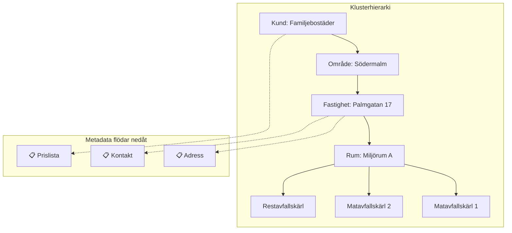
```mermaid
graph TB
    subgraph Hierarki["Klusterhierarki"]
        K[Kund: Familjebostäder]
        O[Område: Södermalm]
        F[Fastighet: Palmgatan 17]
        R[Rum: Miljörum A]
        KARL1[Matavfallskärl 1]
        KARL2[Matavfallskärl 2]
        KARL3[Restavfallskärl]
    end
    
    K --> O
    O --> F
    F --> R
    R --> KARL1
    R --> KARL2
    R --> KARL3
    
    subgraph Meta["Metadata flödar nedåt"]
        M1[📋 Adress]
        M2[📋 Prislista]
        M3[📋 Kontakt]
    end
    
    K -.-> M2
    F -.-> M1
    F -.-> M3
```

## 1.2 Varför är Orderkoncept-processen viktig?

Orderkoncept är **hjärtat i Modus/Kinab**. Det är den process som:

1. **Samlar ihop objekt** - Identifierar vilka kärl/rum/fastigheter som ska serviceras
2. **Definierar uppgifter** - Vilka tjänster ska utföras på objekten
3. **Strukturerar fakturering** - Hur och till vem ska faktura skickas
4. **Skapar leveransplan** - När och hur ofta ska service utföras
5. **Genererar dokument** - Orderbekräftelser, följesedlar, fakturor

**Utan en välfungerande orderkoncept-process kan Kinab inte:**
- Ta emot nya beställningar effektivt
- Skapa återkommande scheman automatiskt
- Fakturera korrekt på rätt nivå
- Ge fältarbetare tydliga uppdrag

## 1.3 Problemet Idag

Nuvarande system saknar en sammanhängande process för orderkoncept. Administratörer måste:

- Manuellt leta reda på objekt i komplexa hierarkier
- Kopiera och klistra metadata mellan system
- Skapa uppgifter en och en
- Hantera fakturering separat

**Mats vision:** En 9-stegs wizard som guidar administratören från objektval till färdig leveransmodell, med automatisk metadata-matchning och intelligent fakturastrukturering.

---

# Del 2: Analys av 9-stegs Processen

## Översikt av Processflöde


```mermaid
flowchart TB
    subgraph Steg1["1. Val av Objekt"]
        S1A[Välj kund]
        S1B[Välj kluster/objekt]
        S1C[Importera data]
    end
    
    subgraph Steg2["2. Bekräftelse"]
        S2A[Träfflista]
        S2B[Manuellt urval]
        S2C[Metadata-filtrering]
    end
    
    subgraph Steg3["3. Fakturamodell"]
        S3A[Faktureringsnivå]
        S3B[Fakturamodell]
        S3C[Faktureringsperiod]
    end
    
    subgraph Steg4["4. Fakturamall"]
        S4A[Välj mall]
        S4B[Metadata på faktura]
        S4C[Export till ekonomisystem]
    end
    
    subgraph Steg5["5. Dokument"]
        S5A[Orderbekräftelse]
        S5B[Följesedel]
        S5C[Faktura]
    end
    
    subgraph Steg6["6. Artiklar"]
        S6A[Lägg till artiklar]
        S6B[Strukturartiklar]
        S6C[Prisberäkning]
    end
    
    subgraph Steg7["7. Artikelkoppling"]
        S7A[Metadata-matchning]
        S7B[Läs metadata]
        S7C[Uppdatera metadata]
    end
    
    subgraph Steg8["8. Kontroll"]
        S8A[Beräkna totaler]
        S8B[Granska detaljer]
        S8C[Korrigera fel]
    end
    
    subgraph Steg9["9. Leveransmodell"]
        S9A[Avrop]
        S9B[Schema]
        S9C[Abonnemang]
    end
    
    Steg1 --> Steg2
    Steg2 --> Steg3
    Steg3 --> Steg4
    Steg4 --> Steg5
    Steg5 --> Steg6
    Steg6 --> Steg7
    Steg7 --> Steg8
    Steg8 --> Steg9
    
    Steg9 --> Result[✅ Färdigt Orderkoncept]
```

---

## Steg 1: Val av Kund, Kluster eller Objekt

### Huvudfunktion

Processen startar genom att administratören definierar vilka objekt ordern ska kopplas till. Detta är fundamentet för hela orderkonceptet.

### Tre Sätt att Välja Objekt

#### Alternativ A: Välj Kund

När administratören väljer en kund identifierar systemet automatiskt alla associerade:

| Typ | Beskrivning | Exempel |
|-----|-------------|---------|
| **Kluster** | Grupperingar av objekt | "Södermalm", "Norrmalm" |
| **Objekt** | Fysiska/organisatoriska enheter | "Miljörum Palmgatan 17" |
| **Adresser** | Platsinformation | "Palmgatan 17, 118 26 Stockholm" |
| **Kontakter** | Kontaktpersoner | "Anna Förvaltare, 070-123 45 67" |
| **Övrig metadata** | All kopplad metadata | Prislista, referensnummer, etc. |

#### Alternativ B: Välj Objekt eller Kluster Manuellt

Administratören kan direkt välja:

- **Ett enskilt objekt** - T.ex. "Matavfallskärl #12345"
- **Ett organisatoriskt objekt** - T.ex. "Avdelning Syd"
- **Ett materiellt objekt** - T.ex. "Fastighet Palmgatan 17"
- **Ett helt kluster** - T.ex. "Alla objekt under Familjebostäder"

#### Alternativ C: Importera Associationsdata

En fil kan laddas upp med exempelvis:

| Importtyp | Exempel |
|-----------|---------|
| **Adresser** | CSV med gatuadresser |
| **Fastighetsnummer** | Lista med fastighetsbeteckningar |
| **Fasadnummer** | Husnummer eller byggnadsidentifierare |
| **Kontaktuppgifter** | E-postadresser, telefonnummer |

Systemet gör då en **metadata-matchning** mot befintliga objekt och kluster:

- **Exakt matchning** - Adress matchar exakt mot objektets adress-metadata
- **Delvis matchning** - Fuzzy matching på liknande adresser eller namn

### Tekniska Krav

| Krav | Beskrivning | Prioritet |
|------|-------------|-----------|
| TK-1.1 | Sökfunktion för kunder med autocomplete | KRITISK |
| TK-1.2 | Hierarkisk objektvisning (träd-vy) | KRITISK |
| TK-1.3 | Import av CSV/Excel-filer | HÖG |
| TK-1.4 | Metadata-matchningsalgoritm (exakt + fuzzy) | HÖG |
| TK-1.5 | Multi-select för objekt och kluster | KRITISK |
| TK-1.6 | Förhandsgranskning av import-matchningar | HÖG |
| TK-1.7 | Stöd för olika teckenkodningar i importfiler | MEDEL |

### Dataflöde

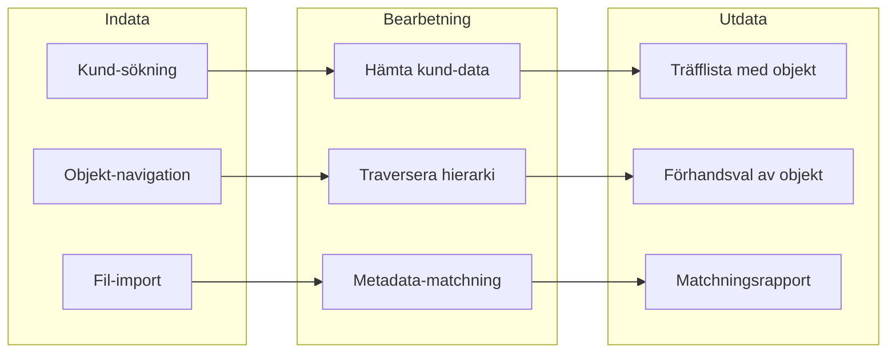
```mermaid
flowchart LR
    subgraph Input["Indata"]
        I1[Kund-sökning]
        I2[Objekt-navigation]
        I3[Fil-import]
    end
    
    subgraph Process["Bearbetning"]
        P1[Hämta kund-data]
        P2[Traversera hierarki]
        P3[Metadata-matchning]
    end
    
    subgraph Output["Utdata"]
        O1[Träfflista med objekt]
        O2[Förhandsval av objekt]
        O3[Matchningsrapport]
    end
    
    I1 --> P1 --> O1
    I2 --> P2 --> O2
    I3 --> P3 --> O3
```

### UI-komponenter

| Komponent | Typ | Beskrivning |
|-----------|-----|-------------|
| Kundsökning | Autocomplete-fält | Sök kund med namn eller kundnummer |
| Objektträd | TreeView | Visar hierarkin med checkboxar |
| Importknapp | Button + FileUpload | Ladda upp fil för import |
| Matchningsmodal | Modal | Visar import-matchningar för bekräftelse |
| Förhandsvisning | Tabell | Listar matchade objekt innan bekräftelse |

### Affärslogik

| Regel | Beskrivning |
|-------|-------------|
| AR-1.1 | Om kund väljs, hämta alla objekt under kundens toppkluster |
| AR-1.2 | Vid import, matcha först på exakt adress, sedan fuzzy |
| AR-1.3 | Fuzzy-matchning kräver minst 80% likhet för förslag |
| AR-1.4 | Import utan matchning flaggas som "ny" eller "ej matchad" |
| AR-1.5 | Objekt kan väljas från olika kunder i samma orderkoncept |

### Konkret Exempel

**Scenario:** Familjebostäder beställer vårtvätt för alla matavfallskärl i område Södermalm.

1. Administratör söker "Familjebostäder" i kundsökningen
2. Systemet visar kundens hierarki:
   ```
   📁 Familjebostäder
   ├── 📁 Stockholm
   │   ├── 📁 Södermalm ✅ (vald)
   │   │   ├── 🏠 Palmgatan 17
   │   │   │   └── 🗑️ Miljörum A
   │   │   │       ├── Matavfallskärl (10 st)
   │   │   │       └── Restavfallskärl (5 st)
   │   │   └── 🏠 Hornsgatan 55
   │   │       └── 🗑️ Soprum B
   │   └── 📁 Norrmalm
   │       └── ...
   ```
3. Administratör markerar "Södermalm" → Alla underobjekt inkluderas
4. Systemet skapar urval med 47 objekt

---

## Steg 2: Bekräftelse och Urval av Objekt

### Huvudfunktion

Systemet presenterar en träfflista baserat på sökningen i steg 1. Administratören kan sedan förfina urvalet innan ordern skapas.

### Träfflista

Listan kan innehålla:

| Typ | Beskrivning | Ikon |
|-----|-------------|------|
| **Enskilda objekt** | Individuella kärl, rum, etc. | 🗑️ |
| **Hela kluster** | Grupperade objekt | 📁 |
| **Objekt med partiell matchning** | Från import | ⚠️ |

### Administratörens Möjligheter

| Åtgärd | Beskrivning |
|--------|-------------|
| **Välja alla objekt** | Checkbox "Välj alla" |
| **Göra manuella urval** | Markera/avmarkera individuellt |
| **Lägga till objekt** | Sök och lägg till ytterligare |
| **Korrigera objekt** | Redigera felaktig metadata |
| **Koppla objekt till kluster** | Flytta objekt mellan kluster |
| **Korrigera metadata** | Uppdatera felaktiga värden |

### Metadata-baserad Filtrering

Systemet kan analysera metadata i urvalet och presentera:

| Filter | Exempel |
|--------|---------|
| **Objekt kopplade till person** | "Visa alla rum där Anna är kontakt" |
| **Objekt av viss typ** | "Visa endast matavfallskärl" |
| **Objekt med viss status** | "Visa objekt med status 'Avvikelse'" |
| **Objekt i geografisk zon** | "Visa objekt inom 500m från GPS-punkt" |
| **Objekt med viss färg** | "Visa gröna kärl" |
| **Objekt med viss kategori** | "Visa objekt i kategori 'Premium'" |

### Tekniska Krav

| Krav | Beskrivning | Prioritet |
|------|-------------|-----------|
| TK-2.1 | Sorterbar/filtrerbar tabell med objekt | KRITISK |
| TK-2.2 | Bulk-operationer (välj alla, avmarkera alla) | KRITISK |
| TK-2.3 | Dynamisk filtrering baserad på metadata | HÖG |
| TK-2.4 | Inline-redigering av metadata | HÖG |
| TK-2.5 | Drag-and-drop för klusterflytt | MEDEL |
| TK-2.6 | Virtualiserad lista för stora dataset (1000+ objekt) | HÖG |
| TK-2.7 | Export av urval till CSV | MEDEL |

### Dataflöde

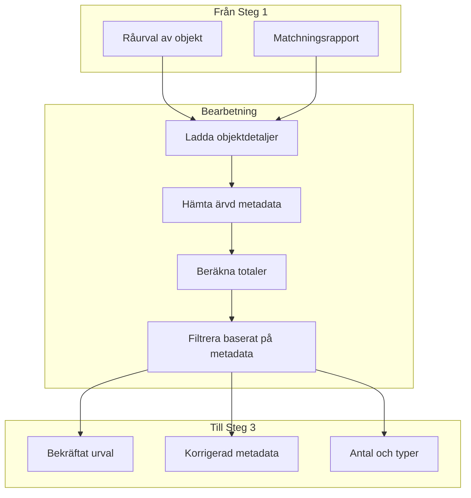
```mermaid
flowchart TB
    subgraph Input["Från Steg 1"]
        I1[Råurval av objekt]
        I2[Matchningsrapport]
    end
    
    subgraph Process["Bearbetning"]
        P1[Ladda objektdetaljer]
        P2[Hämta ärvd metadata]
        P3[Beräkna totaler]
        P4[Filtrera baserat på metadata]
    end
    
    subgraph Output["Till Steg 3"]
        O1[Bekräftat urval]
        O2[Korrigerad metadata]
        O3[Antal och typer]
    end
    
    I1 --> P1
    I2 --> P1
    P1 --> P2 --> P3 --> P4
    P4 --> O1
    P4 --> O2
    P4 --> O3
```

### UI-komponenter

| Komponent | Typ | Beskrivning |
|-----------|-----|-------------|
| Objekttabell | DataGrid | Virtualiserad tabell med kolumner |
| Filterbar | FilterPanel | Dynamiska filter baserade på metadata |
| Summeringskort | Card | Visar antal, typer, totaler |
| Redigeringsmodal | Modal | Inline-redigering av objekt |
| Klusterträd | TreeView | Drag-and-drop för omorganisering |

### Affärslogik

| Regel | Beskrivning |
|-------|-------------|
| AR-2.1 | Minst ett objekt måste väljas för att fortsätta |
| AR-2.2 | Objekt med partiell matchning kräver manuell bekräftelse |
| AR-2.3 | Metadata-ändringar sparas temporärt tills orderkoncept skapas |
| AR-2.4 | Borttagna objekt läggs i "Borttagen"-sektion för återhämtning |
| AR-2.5 | Filter kan kombineras med AND/OR-logik |

### Konkret Exempel

**Scenario:** Fortsättning från Steg 1 - Vårtvätt Södermalm

Systemet visar träfflista:

| ✓ | Objekt | Typ | Adress | Antal | Status |
|---|--------|-----|--------|-------|--------|
| ✅ | Miljörum A | Rum | Palmgatan 17 | 15 kärl | OK |
| ✅ | Soprum B | Rum | Hornsgatan 55 | 8 kärl | OK |
| ⚠️ | Återvinning C | Rum | Götgatan 100 | 12 kärl | Avvikelse |
| ✅ | Miljörum D | Rum | Folkungagatan 23 | 10 kärl | OK |

Administratören:
1. Klickar på ⚠️ för att se avvikelsen: "Saknar kodlås-information"
2. Lägger till kodlås-metadata: "1234#"
3. Filtrerar: "Visa endast matavfallskärl" → 28 objekt
4. Bekräftar urval

---

## Steg 3: Fakturamodell och Faktureringsstruktur

### Huvudfunktion

När objekturvalet är bekräftat definieras vem som står bakom beställningen och hur fakturering ska ske.

### Metadata-analys

Systemet analyserar metadata och identifierar automatiskt:

| Identifierat | Källa | Exempel |
|--------------|-------|---------|
| **Kund** | Toppkluster | "Familjebostäder AB" |
| **Fakturareferenser** | Metadata | "Ref: 2026-001" |
| **Områden** | Klusterstruktur | "Södermalm", "Norrmalm" |
| **Fastigheter** | Objekt | "Palmgatan 17", "Hornsgatan 55" |
| **Kontaktpersoner** | Metadata | "Anna Förvaltare" |

### Faktureringsnivå

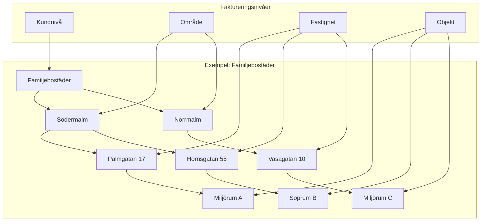
```mermaid
graph TB
    subgraph Nivåer["Faktureringsnivåer"]
        N1[Kundnivå]
        N2[Område]
        N3[Fastighet]
        N4[Objekt]
    end
    
    subgraph Exempel["Exempel: Familjebostäder"]
        K[Familjebostäder]
        O1[Södermalm]
        O2[Norrmalm]
        F1[Palmgatan 17]
        F2[Hornsgatan 55]
        F3[Vasagatan 10]
        OBJ1[Miljörum A]
        OBJ2[Soprum B]
        OBJ3[Miljörum C]
    end
    
    N1 --> K
    K --> O1
    K --> O2
    O1 --> F1
    O1 --> F2
    O2 --> F3
    F1 --> OBJ1
    F2 --> OBJ2
    F3 --> OBJ3
    
    N2 --> O1
    N2 --> O2
    N3 --> F1
    N3 --> F2
    N3 --> F3
    N4 --> OBJ1
    N4 --> OBJ2
    N4 --> OBJ3
```

| Nivå | Beskrivning | Resultat |
|------|-------------|----------|
| **Kundnivå** | En samlingsfaktura för allt | 1 faktura |
| **Område** | En faktura per område | 2 fakturor (Södermalm, Norrmalm) |
| **Fastighet** | En faktura per fastighet | 4 fakturor |
| **Objekt** | En faktura per objekt | 47 fakturor |

### Faktureringsmodell

| Modell | Beskrivning | Fakturering | Användning |
|--------|-------------|-------------|------------|
| **Avrop** | Engångsbeställning | Efter utförande | Enstaka uppdrag |
| **Schema** | Återkommande enligt plan | Efter utförande | Säsongsbaserat |
| **Abonnemang** | Fast månads-/kvartalsavgift | Förskott | Löpande avtal |

### Faktureringsperiod

| Period | Beskrivning | Exempel |
|--------|-------------|---------|
| **Dagligen** | Faktura varje dag | Akuta uppdrag |
| **Veckovis** | Faktura varje vecka | Intensiva perioder |
| **Månadsvis** | Faktura varje månad | Standardval |
| **Kvartalsvis** | Faktura var 3:e månad | Stora kunder |

### Hantering av Restnoterade Uppgifter

Administratören kan definiera om faktura ska skapas:

| Alternativ | Beskrivning | Effekt |
|------------|-------------|--------|
| **Endast när allt levererat** | Faktura väntar | Faktureringslåsning aktiv |
| **Även när delar återstår** | Delfaktura skapas | Restnoterat visas separat |

**Faktureringslåsning:** En flagga som förhindrar faktura tills alla artiklar är levererade.

### Tekniska Krav

| Krav | Beskrivning | Prioritet |
|------|-------------|-----------|
| TK-3.1 | Automatisk identifiering av faktureringsnivåer | KRITISK |
| TK-3.2 | Dropdown för val av fakturamodell | KRITISK |
| TK-3.3 | Konfiguration av faktureringsperiod | KRITISK |
| TK-3.4 | Toggle för restnotering/faktureringslåsning | HÖG |
| TK-3.5 | Förhandsgranskning av antal fakturor | HÖG |
| TK-3.6 | Stöd för olika momssatser | MEDEL |
| TK-3.7 | Valutahantering (SEK standard) | MEDEL |

### Dataflöde

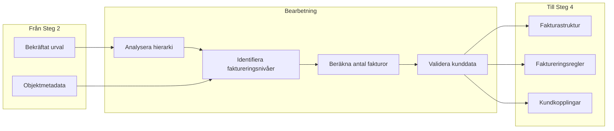
```mermaid
flowchart LR
    subgraph Input["Från Steg 2"]
        I1[Bekräftat urval]
        I2[Objektmetadata]
    end
    
    subgraph Process["Bearbetning"]
        P1[Analysera hierarki]
        P2[Identifiera faktureringsnivåer]
        P3[Beräkna antal fakturor]
        P4[Validera kunddata]
    end
    
    subgraph Output["Till Steg 4"]
        O1[Fakturastruktur]
        O2[Faktureringsregler]
        O3[Kundkopplingar]
    end
    
    I1 --> P1 --> P2 --> P3 --> P4
    I2 --> P2
    P4 --> O1
    P4 --> O2
    P4 --> O3
```

### UI-komponenter

| Komponent | Typ | Beskrivning |
|-----------|-----|-------------|
| Nivåväljare | RadioGroup | Välj faktureringsnivå |
| Modellväljare | RadioGroup | Välj fakturamodell |
| Periodväljare | Dropdown | Välj faktureringsperiod |
| Låsningstoggle | Switch | Aktivera/avaktivera faktureringslåsning |
| Förhandsvisning | Card | Visar antal fakturor och struktur |
| Hierarkivisualisering | TreeView | Visar hur fakturor grupperas |

### Affärslogik

| Regel | Beskrivning |
|-------|-------------|
| AR-3.1 | Fakturamodell "Abonnemang" kräver avtalslängd |
| AR-3.2 | Faktureringslåsning kan endast aktiveras för modell "Avrop" eller "Schema" |
| AR-3.3 | Om flera kunder finns i urval, kräv val av primär kund |
| AR-3.4 | Faktureringsperiod "Dagligen" kräver bekräftelse (ovanligt val) |
| AR-3.5 | Abonnemang beräknar automatiskt månadsavgift |

### Konkret Exempel

**Scenario:** Fakturastruktur för Familjebostäder vårtvätt

Administratören ser:

```
┌─────────────────────────────────────────────────────────────────┐
│ FAKTURASTRUKTUR                                                 │
├─────────────────────────────────────────────────────────────────┤
│ Kund identifierad: Familjebostäder AB (Kundnr: 1001)           │
│ Kontakt: Anna Förvaltare                                        │
│ Objekt i urval: 47 st                                          │
├─────────────────────────────────────────────────────────────────┤
│ ⚪ Kundnivå      → 1 faktura totalt                            │
│ ● Område        → 2 fakturor (Södermalm, Norrmalm)             │
│ ⚪ Fastighet    → 8 fakturor                                   │
│ ⚪ Objekt       → 47 fakturor                                  │
├─────────────────────────────────────────────────────────────────┤
│ Fakturamodell:                                                  │
│ ● Avrop (efterfakturering)                                     │
│ ⚪ Schema (efterfakturering)                                    │
│ ⚪ Abonnemang (månadsfakturering)                               │
├─────────────────────────────────────────────────────────────────┤
│ Faktureringsperiod:                                             │
│ ⚪ Dagligen    ● Månadsvis    ⚪ Kvartalsvis                    │
├─────────────────────────────────────────────────────────────────┤
│ ☐ Faktureringslåsning (vänta tills allt levererat)             │
└─────────────────────────────────────────────────────────────────┘
```

---

## Steg 4: Fakturamallar och Dokumentstruktur

### Huvudfunktion

Administratören väljer vilken fakturamall som ska användas och definierar vilken metadata som ska visas på fakturan.

### Fakturamall

Fakturamallen definierar:

| Element | Beskrivning | Exempel |
|---------|-------------|---------|
| **Uppgifter som visas** | Vilka fält som inkluderas | Artikelnamn, antal, pris |
| **Metadata-presentation** | Hur metadata formateras | "Fastighet: Palmgatan 17" |
| **Layout** | Enligt svensk fakturastandard | SS 62000 |
| **Logotyp** | Företagets logotyp | Kinab-logga |
| **Betalningsvillkor** | Betalningsinformation | "30 dagar netto" |

### Grunddata till Ekonomisystem

Systemet skickar följande till Fortnox (eller annat ekonomisystem):

| Fält | Beskrivning | Exempel |
|------|-------------|---------|
| **Artikelnummer** | Unik artikelkod | "TVÄTT-MAT-125L" |
| **Antal levererade** | Faktiskt antal | 10 |
| **Restnoterat antal** | Återstående | 2 |
| **Pris enligt prislista** | Standardpris | 150 kr |
| **Manuellt pris** | Överskrivet pris | 135 kr |
| **Artikelbeskrivning** | Fritext | "Tvätt av matavfallskärl 125L" |

### Metadata på Fakturarader

Metadata kan läggas till från objekten:

| Metadata | Källa | Placering | Exempel |
|----------|-------|-----------|---------|
| **Fastighetsnummer** | Objekt | Fakturarad | "F-2026-001" |
| **Beställarreferens** | Order | Fakturahuvud | "REF-VÅR-2026" |
| **Objektidentitet** | Objekt | Fakturarad | "Miljörum A, Palmgatan 17" |
| **Adress** | Objekt (ärvd) | Fakturarad | "Palmgatan 17, 118 26 Stockholm" |
| **Avvikelse** | Uppgift | Fakturarad | "Trasigt handtag" |
| **Serviceinformation** | Uppgift | Fakturarad | "Bytt lock" |

### Beställningsmetadata

Administratören kan lägga till beställningsmetadata som kopplas till hela ordern:

| Metadata | Beskrivning | Exempel |
|----------|-------------|---------|
| **Beställningsnummer** | Kundens referens | "Beställning 22" |
| **Kampanjnamn** | Beskrivande namn | "Vårtvätt 2026" |
| **Projektnamn** | Internt projekt | "PROJ-2026-SÖD" |

Denna metadata följer sedan:
- Order
- Uppgifter
- Objekt

### Tekniska Krav

| Krav | Beskrivning | Prioritet |
|------|-------------|-----------|
| TK-4.1 | Mallbibliotek med fördefinierade mallar | KRITISK |
| TK-4.2 | Drag-and-drop för metadata-placering | HÖG |
| TK-4.3 | Förhandsvisning av faktura | KRITISK |
| TK-4.4 | Integration med Fortnox API | KRITISK |
| TK-4.5 | Stöd för PDF-export | HÖG |
| TK-4.6 | Historik över ändringar i mallar | MEDEL |
| TK-4.7 | Testfaktura-funktion | HÖG |

### Dataflöde

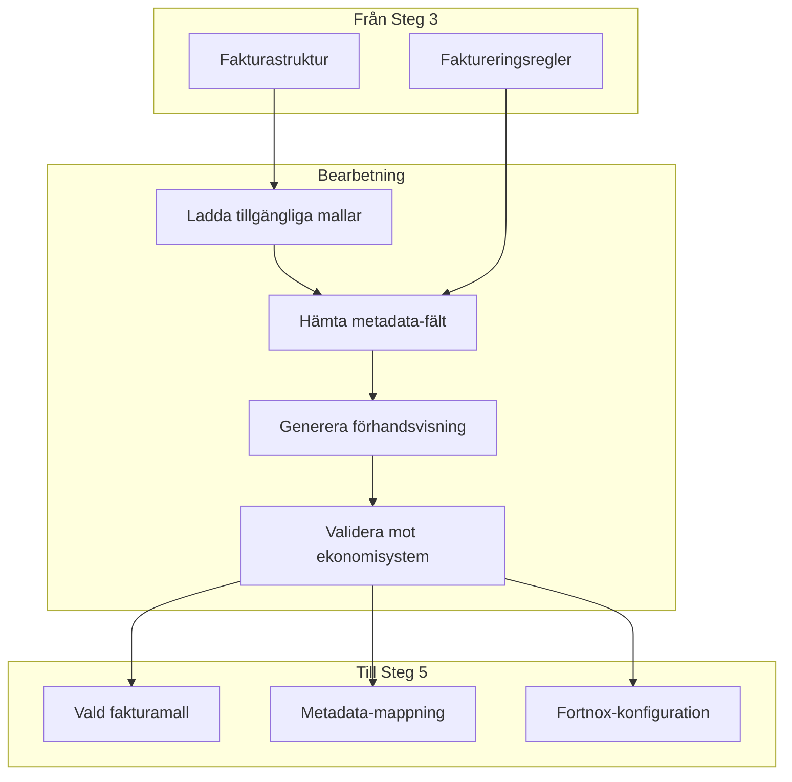
```mermaid
flowchart TB
    subgraph Input["Från Steg 3"]
        I1[Fakturastruktur]
        I2[Faktureringsregler]
    end
    
    subgraph Process["Bearbetning"]
        P1[Ladda tillgängliga mallar]
        P2[Hämta metadata-fält]
        P3[Generera förhandsvisning]
        P4[Validera mot ekonomisystem]
    end
    
    subgraph Output["Till Steg 5"]
        O1[Vald fakturamall]
        O2[Metadata-mappning]
        O3[Fortnox-konfiguration]
    end
    
    I1 --> P1 --> P2 --> P3 --> P4
    I2 --> P2
    P4 --> O1
    P4 --> O2
    P4 --> O3
```

### UI-komponenter

| Komponent | Typ | Beskrivning |
|-----------|-----|-------------|
| Mallväljare | Dropdown | Lista med tillgängliga mallar |
| Metadata-mapper | DragDropList | Dra metadata till huvud/rad |
| Förhandsvisning | IFrame/PDF | Visa hur faktura ser ut |
| Fortnox-panel | Card | Konfiguration för export |
| Beställningsformulär | Form | Lägg till beställningsmetadata |

### Affärslogik

| Regel | Beskrivning |
|-------|-------------|
| AR-4.1 | Standardmall används om ingen väljs |
| AR-4.2 | Obligatoriska metadata måste finnas (kundnr, artikelnr) |
| AR-4.3 | Manuellt pris överskriver prislistepris |
| AR-4.4 | Restnoterat antal visas separat på faktura |
| AR-4.5 | Beställningsmetadata propageras till alla underobjekt |

### Konkret Exempel

**Scenario:** Konfigurera fakturamall för Familjebostäder

```
┌─────────────────────────────────────────────────────────────────┐
│ FAKTURAMALL                                                     │
├─────────────────────────────────────────────────────────────────┤
│ Välj mall: [Familjebostäder Standard v2 ▼]                     │
├─────────────────────────────────────────────────────────────────┤
│ METADATA PÅ FAKTURAHUVUD:                                       │
│ ┌─────────────────┐ ┌─────────────────┐ ┌─────────────────┐    │
│ │ Avdelningsnr    │ │ Kostnadsställe  │ │ Vår referens    │    │
│ └─────────────────┘ └─────────────────┘ └─────────────────┘    │
├─────────────────────────────────────────────────────────────────┤
│ METADATA PÅ FAKTURARAD:                                         │
│ ┌─────────────────┐ ┌─────────────────┐                        │
│ │ Fasadnummer     │ │ Objektidentitet │                        │
│ └─────────────────┘ └─────────────────┘                        │
├─────────────────────────────────────────────────────────────────┤
│ BESTÄLLNINGSMETADATA:                                           │
│ Beställningsnr: [Beställning 22        ]                       │
│ Kampanjnamn:    [Vårtvätt 2026         ]                       │
├─────────────────────────────────────────────────────────────────┤
│ [Förhandsgranska faktura]                                      │
└─────────────────────────────────────────────────────────────────┘
```

---

## Steg 5: Dokumenthantering

### Huvudfunktion

Administratören definierar vilka dokument som ska skapas och hur de ska distribueras.

### Dokumenttyper

| Dokument | Beskrivning | Skapas när |
|----------|-------------|------------|
| **Orderbekräftelse** | Bekräftelse till kund | Order skapas |
| **Följesedel** | Medföljande dokument till fältarbetare | Uppgift startas |
| **Faktura** | Betalningsdokument | Uppgift slutförs |

### Konfiguration per Dokument

| Inställning | Beskrivning | Alternativ |
|-------------|-------------|------------|
| **Metadata som visas** | Vilken information inkluderas | Dropdown multi-select |
| **Visa pris** | Om pris ska synas | Ja/Nej |
| **Mottagare** | Vem ska få dokumentet | E-post, kundportal |

### Distribution

| Metod | Beskrivning | Exempel |
|-------|-------------|---------|
| **E-post** | Skicka till angiven adress | anna.forvaltare@familjebostader.se |
| **Kundportal** | Publicera i kundens portal | https://portal.kinab.se/familjebostader |
| **SMS-avisering** | Skicka notifikation | "Ny faktura tillgänglig" |
| **Fysisk post** | Skriv ut och skicka | (integrerat med tredjepartstjänst) |

### Avisering

Systemet kan:
- Publicera dokument i kundportal
- Skicka avisering till kunden (e-post, SMS)
- Notifiera interna användare

### Tekniska Krav

| Krav | Beskrivning | Prioritet |
|------|-------------|-----------|
| TK-5.1 | Mallbaserad dokumentgenerering | KRITISK |
| TK-5.2 | PDF-export för alla dokumenttyper | KRITISK |
| TK-5.3 | E-postintegration (SMTP/SendGrid) | KRITISK |
| TK-5.4 | Kundportal med dokumentarkiv | HÖG |
| TK-5.5 | SMS-gateway-integration | MEDEL |
| TK-5.6 | Digital signering | LÅG |
| TK-5.7 | Dokumentversionering | MEDEL |

### Dataflöde

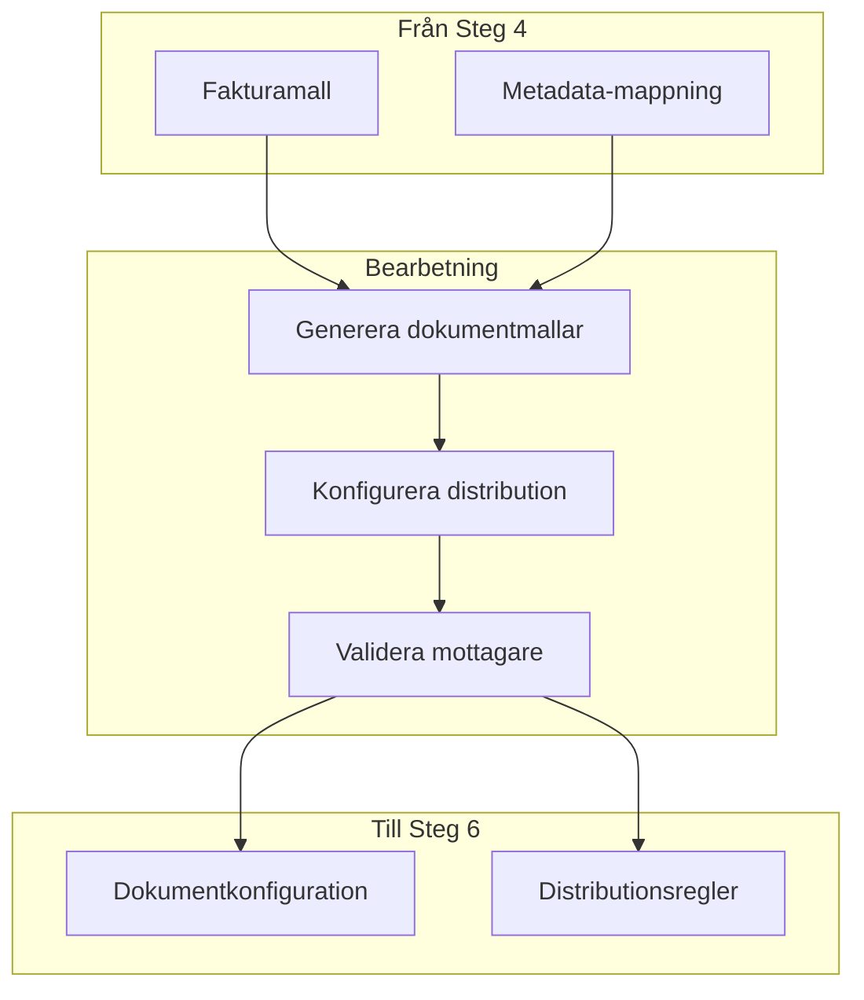
```mermaid
flowchart TB
    subgraph Input["Från Steg 4"]
        I1[Fakturamall]
        I2[Metadata-mappning]
    end
    
    subgraph Process["Bearbetning"]
        P1[Generera dokumentmallar]
        P2[Konfigurera distribution]
        P3[Validera mottagare]
    end
    
    subgraph Output["Till Steg 6"]
        O1[Dokumentkonfiguration]
        O2[Distributionsregler]
    end
    
    I1 --> P1 --> P2 --> P3
    I2 --> P1
    P3 --> O1
    P3 --> O2
```

### UI-komponenter

| Komponent | Typ | Beskrivning |
|-----------|-----|-------------|
| Dokumentlista | Checkbox-lista | Välj vilka dokument som skapas |
| Metadata-väljare | Multi-select | Vilken metadata per dokument |
| Mottagarfält | Input med autocomplete | E-postadresser, telefon |
| Förhandsvisning | Modal | Visa genererat dokument |
| Aviseringsinställningar | Toggle-lista | Aktivera/avaktivera notifieringar |

### Affärslogik

| Regel | Beskrivning |
|-------|-------------|
| AR-5.1 | Orderbekräftelse är obligatorisk |
| AR-5.2 | Faktura kräver minst en mottagare |
| AR-5.3 | Pris kan döljas på följesedel men inte på faktura |
| AR-5.4 | Kundportal-publicering kräver aktiv kundportal-koppling |
| AR-5.5 | E-postmallar kan anpassas per dokumenttyp |

### Konkret Exempel

**Scenario:** Dokumentinställningar för Familjebostäder

```
┌─────────────────────────────────────────────────────────────────┐
│ DOKUMENTHANTERING                                               │
├─────────────────────────────────────────────────────────────────┤
│ ☑ Orderbekräftelse                                             │
│   Metadata: [Beställningsnr ✓] [Objektlista ✓] [Kontakt ✓]    │
│   Visa pris: ● Ja  ⚪ Nej                                       │
│   Mottagare: anna.forvaltare@familjebostader.se                │
│                                                                 │
│ ☑ Följesedel                                                   │
│   Metadata: [Adress ✓] [Kodlås ✓] [Instruktioner ✓]           │
│   Visa pris: ⚪ Ja  ● Nej                                       │
│   Mottagare: (genereras till fältarbetare)                     │
│                                                                 │
│ ☑ Faktura                                                      │
│   Metadata: [Fastighetsnr ✓] [Kostnadsställe ✓]               │
│   Visa pris: ● Ja  ⚪ Nej                                       │
│   Mottagare: ekonomi@familjebostader.se                        │
├─────────────────────────────────────────────────────────────────┤
│ DISTRIBUTION:                                                   │
│ ☑ Publicera i kundportal                                       │
│ ☑ Skicka e-postavisering                                       │
│ ☐ Skicka SMS-avisering                                         │
└─────────────────────────────────────────────────────────────────┘
```

---

## Steg 6: Skapande av Uppgifter och Artiklar

### Huvudfunktion

I detta steg definieras vilka uppgifter eller artiklar som ska utföras på de valda objekten.

### Artikeltyper

| Typ | Beskrivning | Exempel |
|-----|-------------|---------|
| **Tjänster** | Arbete som utförs | "Tvätta matavfallskärl" |
| **Material** | Förbrukningsmaterial | "Tvättmedel 5L" |
| **Kontrollpunkter** | Checklistepunkter | "Kontrollera låsmekanism" |
| **Reservdelar** | Ersättningsdelar | "Nytt lock till kärl" |

### Strukturartiklar (Artikelpaket)

Systemet kan hantera **strukturartiklar**, dvs artikelpaket som består av flera underartiklar.

**Exempel: Tvättuppdrag**

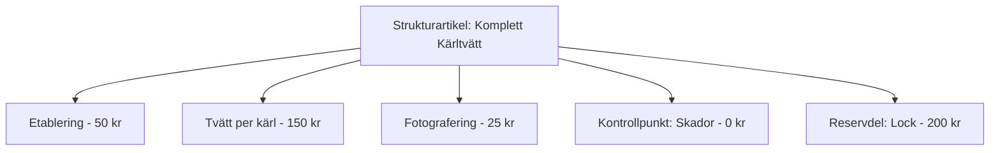
```mermaid
graph TB
    SA[Strukturartikel: Komplett Kärltvätt]
    A1[Etablering - 50 kr]
    A2[Tvätt per kärl - 150 kr]
    A3[Fotografering - 25 kr]
    A4[Kontrollpunkt: Skador - 0 kr]
    A5[Reservdel: Lock - 200 kr]
    
    SA --> A1
    SA --> A2
    SA --> A3
    SA --> A4
    SA --> A5
```

### Prisberäkning

Pris kan styras av:

| Källa | Beskrivning | Prioritet |
|-------|-------------|-----------|
| **Strukturartikel** | Fast pris för paketet | 1 (lägst) |
| **Ingående artiklar** | Summa av delpriser | 2 |
| **Prislista** | Kundens avtalade priser | 3 |
| **Manuellt pris** | Administratörens överskrivning | 4 (högst) |

### Tekniska Krav

| Krav | Beskrivning | Prioritet |
|------|-------------|-----------|
| TK-6.1 | Artikelkatalog med sökfunktion | KRITISK |
| TK-6.2 | Strukturartiklar med underartiklar | KRITISK |
| TK-6.3 | Dynamisk prisberäkning | KRITISK |
| TK-6.4 | Prislistehantering med giltighetstider | HÖG |
| TK-6.5 | Snabbval för vanliga artikelkombinationer | HÖG |
| TK-6.6 | Koppling till lager/inventarie | MEDEL |
| TK-6.7 | Villkorad artikelvisning baserat på objekttyp | HÖG |

### Dataflöde

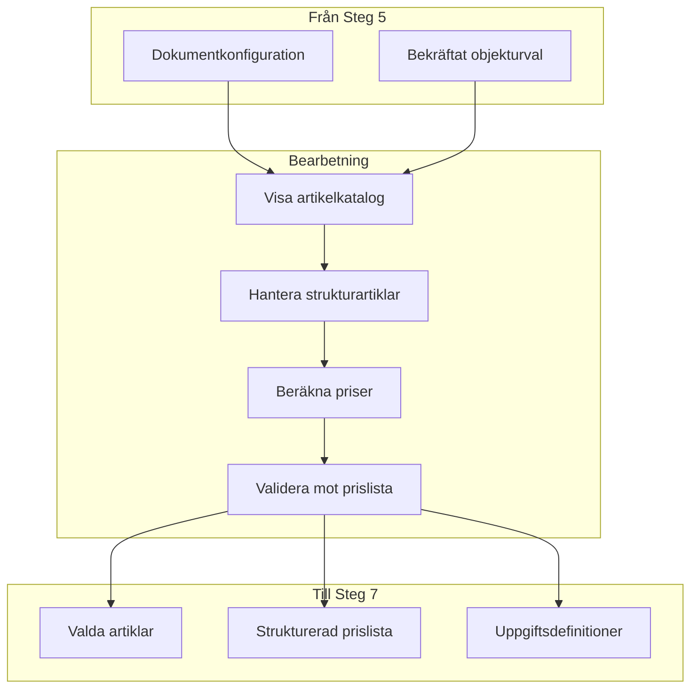
```mermaid
flowchart TB
    subgraph Input["Från Steg 5"]
        I1[Dokumentkonfiguration]
        I2[Bekräftat objekturval]
    end
    
    subgraph Process["Bearbetning"]
        P1[Visa artikelkatalog]
        P2[Hantera strukturartiklar]
        P3[Beräkna priser]
        P4[Validera mot prislista]
    end
    
    subgraph Output["Till Steg 7"]
        O1[Valda artiklar]
        O2[Strukturerad prislista]
        O3[Uppgiftsdefinitioner]
    end
    
    I1 --> P1
    I2 --> P1
    P1 --> P2 --> P3 --> P4
    P4 --> O1
    P4 --> O2
    P4 --> O3
```

### UI-komponenter

| Komponent | Typ | Beskrivning |
|-----------|-----|-------------|
| Artikelsök | Autocomplete | Sök i artikelkatalog |
| Artikellista | DataGrid | Visar valda artiklar med priser |
| Strukturvy | Accordion | Expanderbar vy för strukturartiklar |
| Prisredigering | InputNumber | Manuell prisöverskrivning |
| Kvantitetsfält | InputNumber | Ange antal |
| Snabbknappar | ButtonGroup | Vanliga artikelkombinationer |

### Affärslogik

| Regel | Beskrivning |
|-------|-------------|
| AR-6.1 | Minst en artikel måste väljas för att fortsätta |
| AR-6.2 | Strukturartiklar kan inte innehålla andra strukturartiklar |
| AR-6.3 | Manuellt pris loggas för spårbarhet |
| AR-6.4 | Kontrollpunkter har alltid pris 0 kr |
| AR-6.5 | Reservdelar kan kopplas till lager för inventering |

### Konkret Exempel

**Scenario:** Lägga till artiklar för kärltvätt

```
┌─────────────────────────────────────────────────────────────────┐
│ ARTIKLAR OCH UPPGIFTER                                          │
├─────────────────────────────────────────────────────────────────┤
│ Sök artikel: [Tvätta                 🔍]                        │
│                                                                 │
│ SNABBVAL:                                                       │
│ [Komplett Kärltvätt] [Besiktning] [Reparation] [Byte av lock]  │
├─────────────────────────────────────────────────────────────────┤
│ VALDA ARTIKLAR:                                                 │
│ ┌───────────────────────────────────────────────────────────┐  │
│ │ ▼ Strukturartikel: Komplett Kärltvätt         850 kr     │  │
│ │   ├── Etablering                               50 kr     │  │
│ │   ├── Tvätt matavfallskärl × 28 st           4 200 kr    │  │
│ │   ├── Fotografering före/efter                 75 kr     │  │
│ │   └── Kontrollpunkt: Skador                     0 kr     │  │
│ ├───────────────────────────────────────────────────────────┤  │
│ │ Besiktning dörr                               150 kr     │  │
│ │ Besiktning fönster                            100 kr     │  │
│ └───────────────────────────────────────────────────────────┘  │
├─────────────────────────────────────────────────────────────────┤
│ TOTALT:                                          5 425 kr      │
│ (Prislista: Familjebostäder 2026)                              │
└─────────────────────────────────────────────────────────────────┘
```

---

## Steg 7: Artikelkoppling till Objekt

### Huvudfunktion

När artiklar läggs till gör systemet en **metadata-matchning** mot objekten för att automatiskt koppla rätt artiklar till rätt objekt.

### Metadata-matchning

**Exempel:**

| Artikel | Matchas mot objektets metadata | Resultat |
|---------|--------------------------------|----------|
| "Tvätt av matavfallskärl" | typ = "matavfallskärl" | Alla matavfallskärl i urval |
| "Tvätt av restavfallskärl" | typ = "restavfallskärl" | Alla restavfallskärl i urval |
| "Besiktning dörr" | har_dörr = true | Rum med dörrar |

### Metadata som Läses

Artiklar kan läsa metadata från objekt:

| Metadata | Beskrivning | Användning |
|----------|-------------|------------|
| **Storlek** | Kärlvolym | "Tvätt 125L" vs "Tvätt 240L" |
| **Antal** | Hur många av objektet | Multiplicerar antal |
| **Placering** | Var objektet finns | Instruktioner till fältarbetare |

### Metadata som Uppdateras/Skapas

Artiklar kan även uppdatera eller skapa ny metadata:

| Operation | Beskrivning | Exempel |
|-----------|-------------|---------|
| **Foto** | Bild från fältarbetare | före/efter-bilder |
| **Status** | Ny status på objekt | "Tvättat", "Godkänd" |
| **Kontrollresultat** | Besiktningsresultat | "Dörr: OK" |
| **Avvikelse** | Rapporterad avvikelse | "Trasigt handtag" |

### Tekniska Krav

| Krav | Beskrivning | Prioritet |
|------|-------------|-----------|
| TK-7.1 | Automatisk metadata-matchningsalgoritm | KRITISK |
| TK-7.2 | Manuell override av kopplingar | HÖG |
| TK-7.3 | Visuell representation av kopplingar | HÖG |
| TK-7.4 | Stöd för multipla artiklar per objekt | KRITISK |
| TK-7.5 | Definiera vilken metadata artikeln skapar | HÖG |
| TK-7.6 | Villkorad artikellogik (if-then) | MEDEL |
| TK-7.7 | Validering av matchningar | HÖG |

### Dataflöde

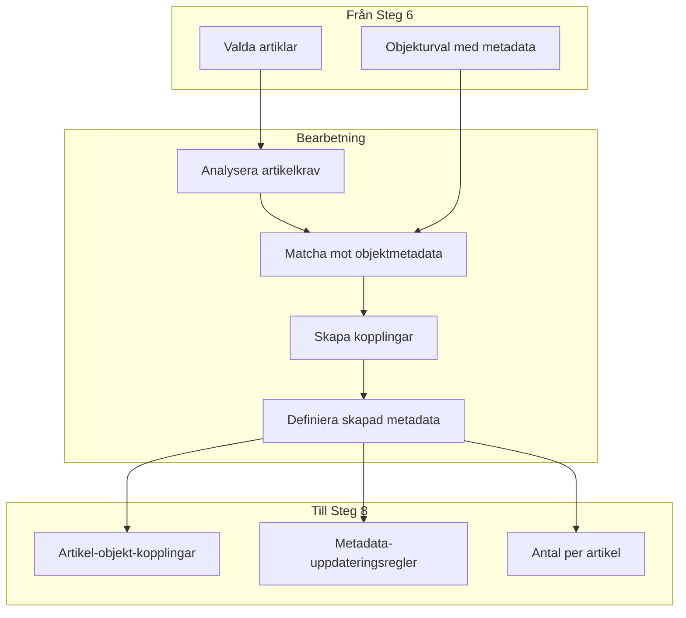
```mermaid
flowchart TB
    subgraph Input["Från Steg 6"]
        I1[Valda artiklar]
        I2[Objekturval med metadata]
    end
    
    subgraph Process["Bearbetning"]
        P1[Analysera artikelkrav]
        P2[Matcha mot objektmetadata]
        P3[Skapa kopplingar]
        P4[Definiera skapad metadata]
    end
    
    subgraph Output["Till Steg 8"]
        O1[Artikel-objekt-kopplingar]
        O2[Metadata-uppdateringsregler]
        O3[Antal per artikel]
    end
    
    I1 --> P1 --> P2 --> P3 --> P4
    I2 --> P2
    P4 --> O1
    P4 --> O2
    P4 --> O3
```

### UI-komponenter

| Komponent | Typ | Beskrivning |
|-----------|-----|-------------|
| Kopplingstabell | DataGrid | Visar artikel ↔ objekt-kopplingar |
| Matchningsindikator | Badge | Visar antal matchningar per artikel |
| Drag-and-drop | DragDropZone | Manuell koppling |
| Metadata-preview | Tooltip | Visar läst metadata per objekt |
| Skapade metadata-lista | List | Vilken metadata artikeln skapar |

### Affärslogik

| Regel | Beskrivning |
|-------|-------------|
| AR-7.1 | Artiklar utan matchningar flaggas för manuell hantering |
| AR-7.2 | Automatisk matchning kan stängas av för manuell koppling |
| AR-7.3 | Foto-metadata kräver kameratillgång i fältapp |
| AR-7.4 | Avvikelser triggar notifikation till planerare |
| AR-7.5 | Kontrollresultat sparas som historik på objekt |

### Konkret Exempel

**Scenario:** Artikelkoppling för Familjebostäder

```
┌─────────────────────────────────────────────────────────────────┐
│ ARTIKELKOPPLING TILL OBJEKT                                     │
├─────────────────────────────────────────────────────────────────┤
│ Artikel: Tvätt matavfallskärl                                   │
│ Matchningskriterium: typ = "matavfallskärl"                     │
│ Matchade objekt: 28 st                                          │
│                                                                 │
│ ┌─────────────────────────────────────────────────────────────┐ │
│ │ ✓ Palmgatan 17 - Miljörum A                                 │ │
│ │   Matavfallskärl 125L (×10)                                 │ │
│ │   Läser: antal=10, storlek=125L                             │ │
│ │   Skapar: foto_före, foto_efter, status                     │ │
│ │                                                             │ │
│ │ ✓ Hornsgatan 55 - Soprum B                                  │ │
│ │   Matavfallskärl 240L (×8)                                  │ │
│ │   Läser: antal=8, storlek=240L                              │ │
│ │   Skapar: foto_före, foto_efter, status                     │ │
│ │                                                             │ │
│ │ ⚠ Götgatan 100 - Återvinning C                              │ │
│ │   Matavfallskärl 125L (×10)                                 │ │
│ │   Läser: antal=10, storlek=125L                             │ │
│ │   Skapar: foto_före, foto_efter, status, avvikelse          │ │
│ └─────────────────────────────────────────────────────────────┘ │
├─────────────────────────────────────────────────────────────────┤
│ Artikel: Besiktning dörr                                        │
│ Matchningskriterium: har_dörr = true                            │
│ Matchade objekt: 4 st (rum med dörrar)                          │
└─────────────────────────────────────────────────────────────────┘
```

---

## Steg 8: Kontroll av Orderkoncept

### Huvudfunktion

När artiklar och objekt kopplats samman beräknar systemet totaler och ger administratören möjlighet att granska och korrigera innan slutförande.

### Beräknade Värden

| Värde | Beskrivning | Beräkning |
|-------|-------------|-----------|
| **Antal** | Totalt antal objekt/artiklar | Summa av alla kopplingar |
| **Arbetstid** | Uppskattad tid | Artiklar × standardtid |
| **Kostnad** | Inköpskostnad | Artiklar × inköpspris |
| **Försäljningsvärde** | Fakturerat belopp | Artiklar × försäljningspris |

### Granskningsfunktioner

Administratören kan:

| Funktion | Beskrivning |
|----------|-------------|
| **Granska hela ordern** | Översikt med totaler |
| **Granska detaljer** | Drill-down per objekt/artikel |
| **Korrigera fel** | Redigera kopplingar/priser |
| **Lägga till saknade artiklar** | Komplettera med fler artiklar |

### Tekniska Krav

| Krav | Beskrivning | Prioritet |
|------|-------------|-----------|
| TK-8.1 | Sammanställningsvy med alla totaler | KRITISK |
| TK-8.2 | Drill-down för detaljer | KRITISK |
| TK-8.3 | Inline-redigering av fel | HÖG |
| TK-8.4 | Validering med felmeddelanden | KRITISK |
| TK-8.5 | Jämförelse med tidigare ordrar | MEDEL |
| TK-8.6 | Export till Excel för granskning | MEDEL |
| TK-8.7 | Godkännandeflöde (för stora ordrar) | MEDEL |

### Dataflöde

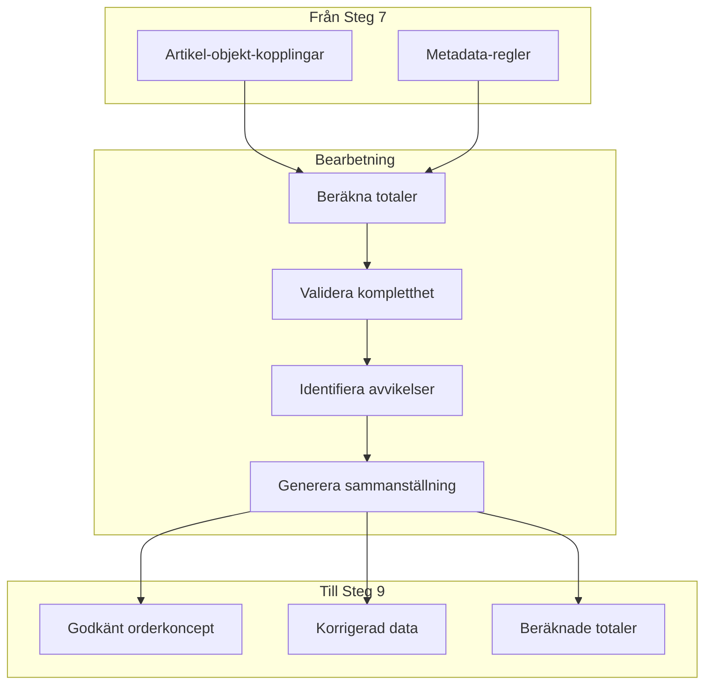
```mermaid
flowchart TB
    subgraph Input["Från Steg 7"]
        I1[Artikel-objekt-kopplingar]
        I2[Metadata-regler]
    end
    
    subgraph Process["Bearbetning"]
        P1[Beräkna totaler]
        P2[Validera kompletthet]
        P3[Identifiera avvikelser]
        P4[Generera sammanställning]
    end
    
    subgraph Output["Till Steg 9"]
        O1[Godkänt orderkoncept]
        O2[Korrigerad data]
        O3[Beräknade totaler]
    end
    
    I1 --> P1 --> P2 --> P3 --> P4
    I2 --> P1
    P4 --> O1
    P4 --> O2
    P4 --> O3
```

### UI-komponenter

| Komponent | Typ | Beskrivning |
|-----------|-----|-------------|
| Sammanfattningskort | Card-grid | Antal, tid, kostnad, värde |
| Detaljrapport | Accordion | Expanderbar per objekt/artikel |
| Felindikator | Alert | Visar valideringsfel |
| Redigeringsmodal | Modal | Snabbkorrigering |
| Godkänn-knapp | Button | Bekräfta och fortsätt |
| Export-knapp | Button | Ladda ner Excel |

### Affärslogik

| Regel | Beskrivning |
|-------|-------------|
| AR-8.1 | Orderkoncept kan inte fortsätta med okorrigerade fel |
| AR-8.2 | Varningar tillåter fortsättning men loggas |
| AR-8.3 | Ordrar över 100 000 kr kräver extra godkännande |
| AR-8.4 | Beräknad arbetstid används för planering |
| AR-8.5 | Marginal (försäljning - kostnad) visas som indikator |

### Konkret Exempel

**Scenario:** Kontroll av Familjebostäders vårtvätt

```
┌─────────────────────────────────────────────────────────────────┐
│ KONTROLL AV ORDERKONCEPT                                        │
├─────────────────────────────────────────────────────────────────┤
│ ┌───────────┐ ┌───────────┐ ┌───────────┐ ┌───────────┐        │
│ │ OBJEKT    │ │ ARBETSTID │ │ KOSTNAD   │ │ VÄRDE     │        │
│ │    47 st  │ │   12 tim  │ │ 3 200 kr  │ │ 5 425 kr  │        │
│ └───────────┘ └───────────┘ └───────────┘ └───────────┘        │
│ Marginal: 2 225 kr (41%)                                       │
├─────────────────────────────────────────────────────────────────┤
│ ⚠ VARNINGAR:                                                    │
│ - Götgatan 100: Saknar kodlås-information (korrigerades Steg 2) │
├─────────────────────────────────────────────────────────────────┤
│ DETALJERAD VY:                                                  │
│ ▼ Palmgatan 17 - Miljörum A                                     │
│   • Tvätt matavfallskärl × 10 = 1 500 kr                       │
│   • Besiktning dörr = 150 kr                                   │
│   Delsumma: 1 650 kr                                           │
│                                                                 │
│ ▶ Hornsgatan 55 - Soprum B (klicka för detaljer)               │
│ ▶ Götgatan 100 - Återvinning C                                  │
│ ▶ Folkungagatan 23 - Miljörum D                                 │
├─────────────────────────────────────────────────────────────────┤
│        [Exportera till Excel]    [← Tillbaka]    [Godkänn →]   │
└─────────────────────────────────────────────────────────────────┘
```

---

## Steg 9: Leveransmodell

### Huvudfunktion

I det sista steget definieras hur ordern ska levereras - engångsuppdrag, återkommande schema, eller abonnemang.

### Tre Huvudtyper av Leveransmodell


```mermaid
graph TB
    subgraph Avrop["Avrop (Engångs)"]
        A1[Beställning skapas]
        A2[Uppgifter utförs]
        A3[Faktura skickas]
        A4[✅ Klart]
    end
    
    subgraph Schema["Schema (Återkommande)"]
        S1[Plan skapas]
        S2[Uppgifter genereras automatiskt]
        S3[Utförs enligt schema]
        S4[Faktura per period]
        S5[🔄 Nästa period]
    end
    
    subgraph Abonnemang["Abonnemang (Löpande)"]
        AB1[Avtal startar]
        AB2[Månadsavgift faktureras]
        AB3[Uppgifter utförs vid behov]
        AB4[🔄 Fortsätter tills uppsägning]
    end
    
    A1 --> A2 --> A3 --> A4
    S1 --> S2 --> S3 --> S4 --> S5 --> S2
    AB1 --> AB2 --> AB3 --> AB4 --> AB2
```

### Leveransmodell: Avrop

| Egenskap | Beskrivning |
|----------|-------------|
| **Definition** | Engångsbeställning |
| **Fakturering** | Efter utförande |
| **Användning** | Enstaka uppdrag, akuta ärenden |
| **Ingen** återkommande automatik | - |

### Leveransmodell: Schema

| Egenskap | Beskrivning |
|----------|-------------|
| **Definition** | Återkommande uppdrag enligt plan |
| **Fakturering** | Efter utförande, per period |
| **Användning** | Säsongsbaserat, planerat underhåll |
| **Rullande** förlängning | Ja, enligt konfiguration |

### Leveransmodell: Abonnemang

| Egenskap | Beskrivning |
|----------|-------------|
| **Definition** | Periodisk leverans tillsvidare/avtalsperiod |
| **Fakturering** | Förskott, fast månads-/kvartalsavgift |
| **Användning** | Löpande avtal |
| **Automatisk** beräkning av månadsavgift | Ja |

### Administrativa Inställningar

| Inställning | Beskrivning | Tillämplig modell |
|-------------|-------------|-------------------|
| **Leveransperiod** | Start- och slutdatum | Avrop, Schema |
| **Startdatum** | När leverans börjar | Alla |
| **Periodicitet** | Hur ofta (dag, vecka, månad) | Schema, Abonnemang |
| **Avtalslängd** | Bindningstid | Abonnemang |
| **Tidsfönster** | Vår, sommar, höst | Schema |
| **Minsta avstånd** | Dagar mellan uppdrag | Schema |

### Tekniska Krav

| Krav | Beskrivning | Prioritet |
|------|-------------|-----------|
| TK-9.1 | Tre leveransmodeller med konfiguration | KRITISK |
| TK-9.2 | Schemaläggningsmotor för återkommande | KRITISK |
| TK-9.3 | Abonnemangsberäkning (månadsavgift) | KRITISK |
| TK-9.4 | Rullande förlängning för Schema | HÖG |
| TK-9.5 | Avtalsspärr för offentliga kunder | HÖG |
| TK-9.6 | Kalenderintegration | MEDEL |
| TK-9.7 | Periodicitetskonfiguration (n dagar/veckor/månader) | KRITISK |

### Dataflöde

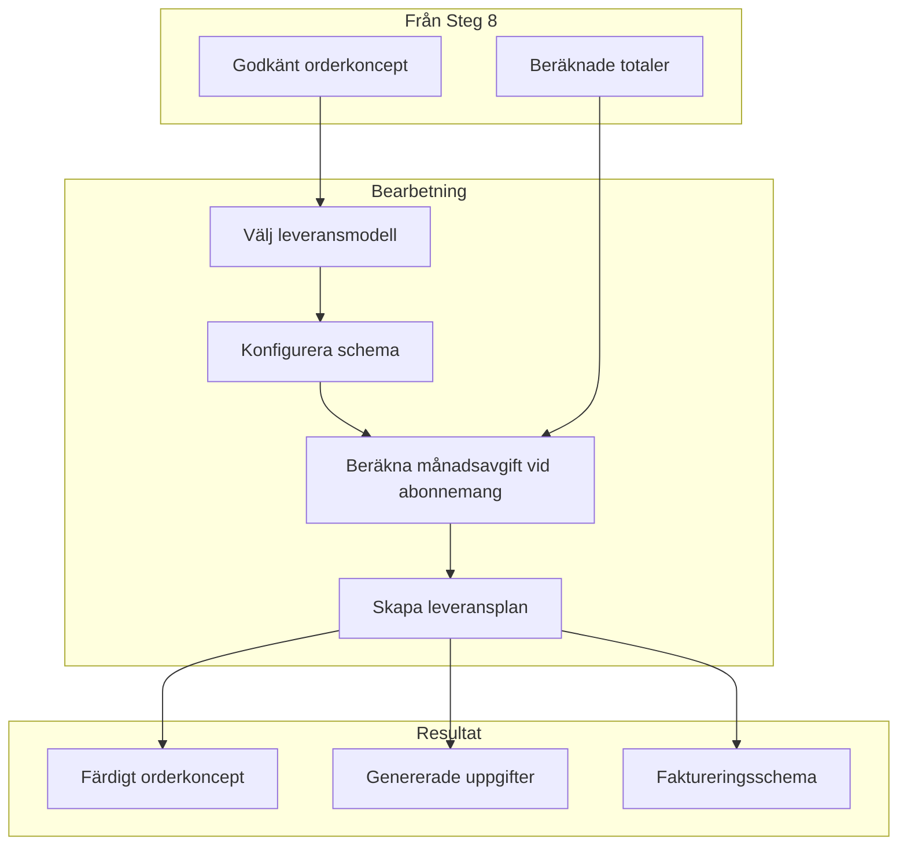
```mermaid
flowchart TB
    subgraph Input["Från Steg 8"]
        I1[Godkänt orderkoncept]
        I2[Beräknade totaler]
    end
    
    subgraph Process["Bearbetning"]
        P1[Välj leveransmodell]
        P2[Konfigurera schema]
        P3[Beräkna månadsavgift vid abonnemang]
        P4[Skapa leveransplan]
    end
    
    subgraph Output["Resultat"]
        O1[Färdigt orderkoncept]
        O2[Genererade uppgifter]
        O3[Faktureringsschema]
    end
    
    I1 --> P1 --> P2 --> P3 --> P4
    I2 --> P3
    P4 --> O1
    P4 --> O2
    P4 --> O3
```

### UI-komponenter

| Komponent | Typ | Beskrivning |
|-----------|-----|-------------|
| Modellväljare | RadioGroup | Avrop, Schema, Abonnemang |
| Datumväljare | DatePicker | Start/slut |
| Periodicitetsväljare | Dropdown + Input | Var X dag/vecka/månad |
| Tidsfönsterväljare | Checkbox-lista | Vår, sommar, höst, vinter |
| Månadsberäknare | ReadOnly | Visar beräknad månadsavgift |
| Avtalskonfiguration | Form | Avtalslängd, uppsägningsvillkor |
| Kalenderförhandsvisning | Calendar | Visar planerade uppdrag |

### Affärslogik

| Regel | Beskrivning |
|-------|-------------|
| AR-9.1 | Abonnemang kräver avtalslängd |
| AR-9.2 | Schema med tidsfönster skapar uppgifter automatiskt |
| AR-9.3 | Minsta avstånd förhindrar för täta uppdrag (standard: 60 dagar) |
| AR-9.4 | Rullande förlängning körs veckovis |
| AR-9.5 | Avtalsspärr för offentliga kunder blockerar prisändring under period |
| AR-9.6 | Abonnemangsändring kräver godkännande |

### Konkret Exempel

**Scenario:** Leveransmodell för Familjebostäder vårtvätt

```
┌─────────────────────────────────────────────────────────────────┐
│ LEVERANSMODELL                                                  │
├─────────────────────────────────────────────────────────────────┤
│ Välj modell:                                                    │
│ ⚪ Avrop (engångsbeställning)                                   │
│ ● Schema (återkommande enligt plan)                             │
│ ⚪ Abonnemang (fast månadsavgift)                               │
├─────────────────────────────────────────────────────────────────┤
│ SCHEMAKONFIGURATION:                                            │
│                                                                 │
│ Leveransperiod:                                                 │
│ ☑ Vår (feb-apr)    ☑ Sommar (maj-jul)    ☑ Höst (sep-nov)     │
│                                                                 │
│ Startdatum: [2026-03-01]                                       │
│ Slutdatum:  ☑ Rullande (automatisk förlängning 12 månader)     │
│                                                                 │
│ Minsta avstånd mellan uppdrag: [60] dagar                      │
├─────────────────────────────────────────────────────────────────┤
│ PLANERADE UPPDRAG (förhandsvisning):                            │
│                                                                 │
│ 📅 Mars 2026:    Vårtvätt Södermalm (28 kärl)                  │
│ 📅 Juni 2026:    Sommartvätt Södermalm (28 kärl)               │
│ 📅 Oktober 2026: Hösttvätt Södermalm (28 kärl)                 │
│ 📅 Mars 2027:    Vårtvätt Södermalm (28 kärl) [automatisk]     │
├─────────────────────────────────────────────────────────────────┤
│                                              [Skapa Orderkoncept]│
└─────────────────────────────────────────────────────────────────┘
```

---

# Del 3: Identifierade Nyckelfunktioner

## Kategori 1: Objekthantering

### 1.1 Sökning och Urval av Objekt

| Funktion | Beskrivning | Komplexitet |
|----------|-------------|-------------|
| **Kundsökning** | Autocomplete med fuzzy-matching | Medel |
| **Objektträd** | Hierarkisk visning med expand/collapse | Hög |
| **Multi-select** | Välj flera objekt/kluster samtidigt | Medel |
| **Filtrering** | Dynamiska filter baserat på metadata | Hög |
| **Bulk-operationer** | Välj alla, avmarkera alla | Låg |

### 1.2 Metadata-matchning

| Funktion | Beskrivning | Komplexitet |
|----------|-------------|-------------|
| **Exakt matchning** | Adress == adress | Låg |
| **Fuzzy matchning** | Levenshtein-avstånd | Hög |
| **Typ-matchning** | Artikel kräver objekttyp | Medel |
| **Matchningsrapport** | Visa matchade/ej matchade | Medel |

### 1.3 Klusterhantering

| Funktion | Beskrivning | Komplexitet |
|----------|-------------|-------------|
| **Skapa kluster** | Gruppera objekt | Medel |
| **Flytta objekt** | Drag-and-drop mellan kluster | Hög |
| **Arv av metadata** | Propagera metadata nedåt | Hög |
| **Nivålås** | Stoppa arv vid viss nivå | Medel |

### 1.4 Import av Associationsdata

| Funktion | Beskrivning | Komplexitet |
|----------|-------------|-------------|
| **CSV-import** | Ladda upp fil | Medel |
| **Excel-import** | Stöd för .xlsx | Medel |
| **Fältmappning** | Koppla kolumner till metadata | Hög |
| **Validering** | Kontrollera data innan import | Hög |

---

## Kategori 2: Fakturahantering

### 2.1 Faktureringsnivåer

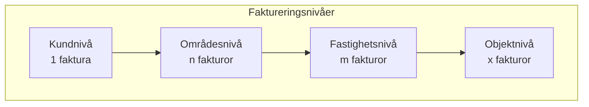
```mermaid
graph TB
    subgraph Nivåer["Faktureringsnivåer"]
        K[Kundnivå<br/>1 faktura]
        O[Områdesnivå<br/>n fakturor]
        F[Fastighetsnivå<br/>m fakturor]
        OBJ[Objektnivå<br/>x fakturor]
    end
    
    K --> O --> F --> OBJ
```

| Nivå | Beskrivning | Aggregering |
|------|-------------|-------------|
| **Kund** | Allt på en faktura | Maximal |
| **Område** | Per geografiskt område | Hög |
| **Fastighet** | Per fastighet/adress | Medel |
| **Objekt** | Per individuellt objekt | Ingen |

### 2.2 Fakturamodeller

| Modell | Faktureras | Tidpunkt | Fortnox-integration |
|--------|-----------|----------|---------------------|
| **Avrop** | Utförda artiklar | Efter slutförande | Ja |
| **Schema** | Utförda artiklar | Efter period | Ja |
| **Abonnemang** | Fast avgift | Månadsvis i förskott | Ja |

### 2.3 Faktureringsperioder

| Period | Triggning | Användning |
|--------|-----------|------------|
| **Dagligen** | 00:00 varje dag | Akutuppdrag |
| **Veckovis** | Måndag 00:00 | Intensiv drift |
| **Månadsvis** | 1:a varje månad | Standard |
| **Kvartalsvis** | 1:a jan, apr, jul, okt | Stora kunder |

### 2.4 Restnoterade Uppgifter

| Scenario | Beteende | Faktureringslåsning |
|----------|----------|---------------------|
| Allt utfört | Faktura skapas | N/A |
| Delvis utfört | Delfaktura | Nej |
| Delvis utfört | Vänta på allt | Ja |

### 2.5 Integration med Fortnox

| Data | Riktning | Format |
|------|----------|--------|
| Artiklar | Kinab → Fortnox | JSON/API |
| Kunder | Synkronisering | JSON/API |
| Fakturor | Kinab → Fortnox | JSON/API |
| Betalningar | Fortnox → Kinab | Webhook |

---

## Kategori 3: Artikelhantering

### 3.1 Strukturartiklar (Artikelpaket)

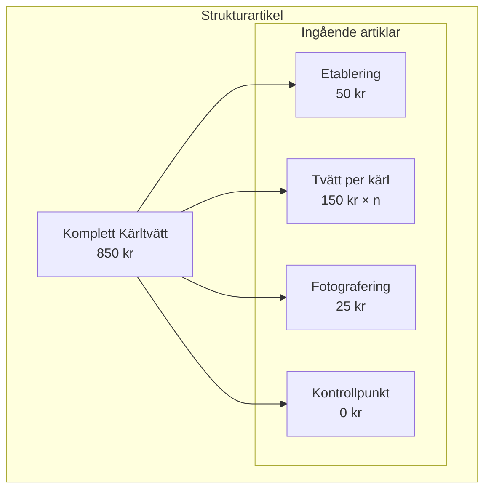
```mermaid
graph TB
    subgraph Struktur["Strukturartikel"]
        SA[Komplett Kärltvätt<br/>850 kr]
        
        subgraph Delar["Ingående artiklar"]
            A1[Etablering<br/>50 kr]
            A2[Tvätt per kärl<br/>150 kr × n]
            A3[Fotografering<br/>25 kr]
            A4[Kontrollpunkt<br/>0 kr]
        end
    end
    
    SA --> A1
    SA --> A2
    SA --> A3
    SA --> A4
```

| Funktion | Beskrivning |
|----------|-------------|
| **Skapa strukturartikel** | Definiera paket med underartiklar |
| **Prisstyrning** | Välj fast pris eller summa av delar |
| **Dynamisk expansion** | Expandera vid orderläggning |
| **Rapportering** | Visa utförda delar separat |

### 3.2 Artikelkoppling via Metadata

| Matchningstyp | Exempel | Resultat |
|---------------|---------|----------|
| **Typbaserad** | typ="matavfallskärl" → Tvätt matavfall | Automatisk koppling |
| **Attributbaserad** | storlek > 200L → Tvätt stor | Villkorad koppling |
| **Manuell** | Administratör väljer | Full kontroll |

### 3.3 Artiklar som Läser/Uppdaterar Metadata

| Operation | Beskrivning | Exempel |
|-----------|-------------|---------|
| **Läser** | Artikeln hämtar metadata från objekt | Antal, storlek, placering |
| **Uppdaterar** | Artikeln ändrar befintlig metadata | Status → "Tvättat" |
| **Skapar** | Artikeln genererar ny metadata | Foto före, foto efter |

### 3.4 Prisberäkning

| Källa | Prioritet | Beskrivning |
|-------|-----------|-------------|
| Manuellt pris | 1 (högst) | Administratörens override |
| Kundprislista | 2 | Avtalade priser |
| Standardprislista | 3 | Allmänna priser |
| Strukturartikelpris | 4 (lägst) | Paketpris |

---

## Kategori 4: Dokumenthantering

### 4.1 Dokumenttyper

| Dokument | Skapas | Mottagare | Innehåll |
|----------|--------|-----------|----------|
| **Orderbekräftelse** | Vid orderläggning | Kund | Objekt, artiklar, pris |
| **Följesedel** | Vid uppgiftsstart | Fältarbetare | Instruktioner, adress, kod |
| **Faktura** | Vid slutförande | Kund/Ekonomi | Utförda artiklar, totaler |

### 4.2 Dokumentmallar

| Element | Konfigurerbart |
|---------|----------------|
| Logotyp | Ja |
| Header-fält | Ja |
| Radfält | Ja |
| Footer | Ja |
| Betalningsvillkor | Ja |
| Layout | Delvis (mallar) |

### 4.3 Metadata på Dokument

| Metadata | Fakturahuvud | Fakturarad |
|----------|--------------|------------|
| Kundnummer | ✓ | |
| Avdelningsnummer | ✓ | |
| Kostnadsställe | ✓ | |
| Fastighetsnummer | | ✓ |
| Objektidentitet | | ✓ |
| Adress | | ✓ |
| Avvikelse | | ✓ |

### 4.4 Kundportal

| Funktion | Beskrivning |
|----------|-------------|
| **Dokumentarkiv** | Alla historiska dokument |
| **Nedladdning** | PDF-export |
| **Notifikationer** | E-post/SMS vid nytt dokument |
| **Självservice** | Beställ nytt uppdrag |

### 4.5 Avisering

| Kanal | Stöd | Konfiguration |
|-------|------|---------------|
| E-post | Ja | Mallar, mottagare |
| SMS | Ja | Kort notifikation |
| Push | Planerat | Mobilapp |
| In-app | Ja | Kundportal |

---

## Kategori 5: Leveransmodeller

### 5.1 Avrop (Engångsbeställning)

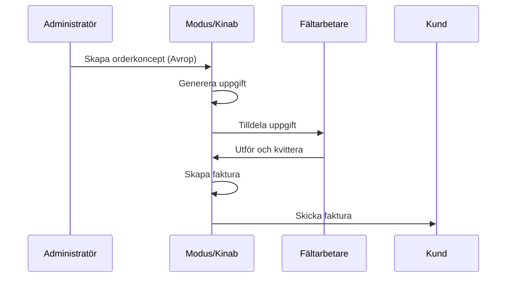
```mermaid
sequenceDiagram
    participant Admin as Administratör
    participant System as Modus/Kinab
    participant Fält as Fältarbetare
    participant Kund as Kund
    
    Admin->>System: Skapa orderkoncept (Avrop)
    System->>System: Generera uppgift
    System->>Fält: Tilldela uppgift
    Fält->>System: Utför och kvittera
    System->>System: Skapa faktura
    System->>Kund: Skicka faktura
```

### 5.2 Schema (Återkommande)

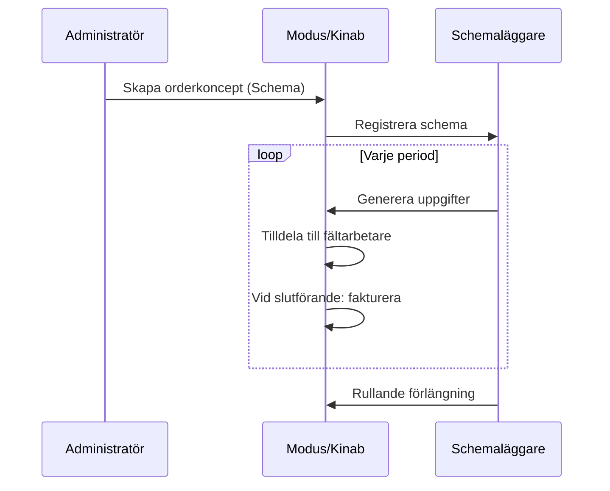
```mermaid
sequenceDiagram
    participant Admin as Administratör
    participant System as Modus/Kinab
    participant Scheduler as Schemaläggare
    
    Admin->>System: Skapa orderkoncept (Schema)
    System->>Scheduler: Registrera schema
    loop Varje period
        Scheduler->>System: Generera uppgifter
        System->>System: Tilldela till fältarbetare
        System->>System: Vid slutförande: fakturera
    end
    Scheduler->>System: Rullande förlängning
```

### 5.3 Abonnemang (Periodisk)

| Element | Beskrivning |
|---------|-------------|
| **Fast avgift** | Beräknas utifrån objekt och frekvens |
| **Förskottsfakturering** | Faktureras innan utförande |
| **Automatisk förnyelse** | Tillsvidare eller till slutdatum |
| **Ändringshantering** | Kräver godkännande |

### 5.4 Leveransperioder

| Period | Definition | Exempel |
|--------|------------|---------|
| **Vår** | feb-apr | Vårtvätt |
| **Sommar** | maj-jul | Sommartvätt |
| **Höst** | sep-nov | Hösttvätt |
| **Vinter** | dec-jan | (Sällan använd) |

### 5.5 Periodicitet

| Typ | Konfiguration | Exempel |
|-----|---------------|---------|
| **Daglig** | Var N:e dag | Var 1:a dag |
| **Veckovis** | Var N:e vecka, dag | Var 2:a vecka, tisdag |
| **Månadsvis** | Var N:e månad, datum | Var 3:e månad, 15:e |
| **Årlig** | Specifika månader | Mars, juni, oktober |

---

# Del 4: Strukturerad Prompt till Replit 3.0

## Inledning

Detta avsnitt innehåller den faktiska prompten som ska användas för att fråga Replit 3.0 om implementering av orderkoncept-processen.

---

## PROMPT TILL REPLIT 3.0

```
# Orderkoncept-Process: Implementation i Modus/Kinab

## Bakgrund

Vi utvecklar ett fältservicesystem (Modus/Kinab) för avfallshantering, 
kärltvätt och fastighetsservice. Systemet bygger på en hierarkisk 
klusterstruktur där objekt (kärl, rum, fastigheter) organiseras under 
kunder och områden.

Vi behöver implementera en 9-stegs wizard för att skapa "orderkoncept" - 
en komplett orderprocess som inkluderar objektval, artikelkoppling, 
fakturering och leveransmodell.

## Befintligt System

Vi har redan:
- Objektdatabas med hierarkisk klusterstruktur
- Metadata-system ("post-it-lappar" som hakar fast på objekt)
- Grundläggande artikelkatalog
- Integration med Fortnox (ekonomisystem)
- Fältarbetarapp (React Native)

## De 9 Stegen

### Steg 1: Val av Kund, Kluster eller Objekt

**Funktionalitet:**
- Sök och välj kund (autocomplete)
- Navigera i objekthierarkin (träd-vy)
- Importera adresser/fastighetsnummer från CSV/Excel
- Metadata-matchning mot befintliga objekt

**Frågor till Replit 3.0:**
1. Hur implementerar vi bäst en hierarkisk träd-vy med checkboxar för multi-select?
2. Kan vi använda fuzzy-matching för adressimport? Vilken algoritm rekommenderas?
3. Hur hanterar vi stora dataset (10 000+ objekt) effektivt i UI?

### Steg 2: Bekräftelse och Urval av Objekt

**Funktionalitet:**
- Visa träfflista med objekt från steg 1
- Filtrera baserat på metadata (typ, status, zon)
- Manuellt urval (markera/avmarkera)
- Inline-redigering av metadata

**Frågor till Replit 3.0:**
1. Vilken tabell-komponent rekommenderas för virtualiserad rendering?
2. Hur implementerar vi dynamiska filter baserat på metadata-schema?
3. Kan metadata-ändringar sparas temporärt innan orderkoncept skapas?

### Steg 3: Fakturamodell och Faktureringsstruktur

**Funktionalitet:**
- Analysera hierarki och identifiera faktureringsnivåer
- Välja fakturamodell (Avrop, Schema, Abonnemang)
- Konfigurera faktureringsperiod (dag, vecka, månad)
- Hantera restnoterade uppgifter (faktureringslåsning)

**Frågor till Replit 3.0:**
1. Hur strukturerar vi databasen för att stödja fyra faktureringsnivåer?
2. Kan vi dynamiskt beräkna antal fakturor baserat på vald nivå?
3. Hur implementerar vi faktureringslåsning på artikelnivå?

### Steg 4: Fakturamallar och Dokumentstruktur

**Funktionalitet:**
- Mallbibliotek med fördefinierade mallar
- Drag-and-drop för metadata-placering (huvud/rad)
- Förhandsvisning av faktura
- Export till Fortnox

**Frågor till Replit 3.0:**
1. Vilken teknologi rekommenderas för PDF-generering?
2. Hur designar vi ett flexibelt mall-system?
3. Kan vi integrera med Fortnox API för att synkronisera artiklar?

### Steg 5: Dokumenthantering

**Funktionalitet:**
- Konfigurera vilka dokument som skapas
- Definiera metadata per dokumenttyp
- Distribution (e-post, kundportal, SMS)

**Frågor till Replit 3.0:**
1. Vilken e-posttjänst rekommenderas (SendGrid, AWS SES)?
2. Hur bygger vi en kundportal med dokumentarkiv?
3. Kan vi implementera webhooks för dokumentstatus?

### Steg 6: Skapande av Uppgifter och Artiklar

**Funktionalitet:**
- Artikelkatalog med sökfunktion
- Strukturartiklar (artikelpaket med underartiklar)
- Dynamisk prisberäkning
- Snabbval för vanliga kombinationer

**Frågor till Replit 3.0:**
1. Hur implementerar vi strukturartiklar i datamodellen?
2. Kan prisberäkning hantera fyra nivåer av prisöverskrivning?
3. Vilken UI-komponent passar för expanderbara artikelpaket?

### Steg 7: Artikelkoppling till Objekt

**Funktionalitet:**
- Automatisk metadata-matchning (artikel → objekt)
- Läsa metadata från objekt
- Uppdatera/skapa metadata vid utförande
- Visuell representation av kopplingar

**Frågor till Replit 3.0:**
1. Hur implementerar vi matching-regler för artiklar?
2. Kan metadata-uppdatering från fältarbetare trigga webhooks?
3. Hur visualiserar vi kopplingar mellan artiklar och objekt?

### Steg 8: Kontroll av Orderkoncept

**Funktionalitet:**
- Beräkna totaler (antal, tid, kostnad, värde)
- Drill-down för detaljer
- Validering med felmeddelanden
- Export till Excel

**Frågor till Replit 3.0:**
1. Hur implementerar vi validering med affärsregler?
2. Kan vi skapa drill-down-rapporter med accordion-komponenter?
3. Vilken Excel-bibliotek rekommenderas för export?

### Steg 9: Leveransmodell

**Funktionalitet:**
- Tre leveransmodeller (Avrop, Schema, Abonnemang)
- Schemaläggning för återkommande uppdrag
- Rullande förlängning
- Abonnemangsberäkning (månadsavgift)

**Frågor till Replit 3.0:**
1. Hur implementerar vi en schemaläggningsmotor för återkommande uppgifter?
2. Kan vi använda cron-jobb för rullande förlängning?
3. Hur beräknar vi dynamisk månadsavgift för abonnemang?

## Datamodell

Vi behöver följande tabeller (PostgreSQL):

### Tabell: order_concepts
- id: UUID PRIMARY KEY
- customer_id: UUID REFERENCES customers(id)
- name: VARCHAR(255)
- status: ENUM('draft', 'active', 'completed', 'cancelled')
- invoice_level: ENUM('customer', 'area', 'property', 'object')
- invoice_model: ENUM('call_off', 'schedule', 'subscription')
- invoice_period: ENUM('daily', 'weekly', 'monthly', 'quarterly')
- invoice_lock: BOOLEAN DEFAULT FALSE
- delivery_model: ENUM('call_off', 'schedule', 'subscription')
- delivery_start: DATE
- delivery_end: DATE
- periodicity: JSONB
- monthly_fee: DECIMAL(10,2)
- contract_length_months: INTEGER
- created_at: TIMESTAMP
- updated_at: TIMESTAMP

### Tabell: order_concept_objects
- id: UUID PRIMARY KEY
- order_concept_id: UUID REFERENCES order_concepts(id)
- object_id: UUID REFERENCES objects(id)
- metadata_snapshot: JSONB
- created_at: TIMESTAMP

### Tabell: order_concept_articles
- id: UUID PRIMARY KEY
- order_concept_id: UUID REFERENCES order_concepts(id)
- article_id: UUID REFERENCES articles(id)
- quantity: INTEGER
- unit_price: DECIMAL(10,2)
- price_override: BOOLEAN DEFAULT FALSE
- metadata_rules: JSONB
- created_at: TIMESTAMP

### Tabell: article_object_mappings
- id: UUID PRIMARY KEY
- order_concept_article_id: UUID
- order_concept_object_id: UUID
- quantity: INTEGER
- metadata_read: JSONB
- metadata_create: JSONB
- created_at: TIMESTAMP

### Tabell: invoice_configurations
- id: UUID PRIMARY KEY
- order_concept_id: UUID REFERENCES order_concepts(id)
- template_id: UUID REFERENCES templates(id)
- header_metadata: JSONB
- line_metadata: JSONB
- recipients: JSONB
- created_at: TIMESTAMP

### Tabell: document_configurations
- id: UUID PRIMARY KEY
- order_concept_id: UUID REFERENCES order_concepts(id)
- document_type: ENUM('order_confirmation', 'delivery_note', 'invoice')
- template_id: UUID
- metadata_fields: JSONB
- show_price: BOOLEAN
- recipients: JSONB
- distribution_channels: JSONB
- created_at: TIMESTAMP

### Tabell: delivery_schedules
- id: UUID PRIMARY KEY
- order_concept_id: UUID REFERENCES order_concepts(id)
- season: ENUM('spring', 'summer', 'fall', 'winter')
- start_date: DATE
- end_date: DATE
- periodicity_value: INTEGER
- periodicity_unit: ENUM('days', 'weeks', 'months')
- min_days_between: INTEGER DEFAULT 60
- rolling_extension: BOOLEAN DEFAULT TRUE
- rolling_months: INTEGER DEFAULT 12
- created_at: TIMESTAMP

### Tabell: structure_articles
- id: UUID PRIMARY KEY
- parent_article_id: UUID REFERENCES articles(id)
- child_article_id: UUID REFERENCES articles(id)
- quantity: INTEGER
- created_at: TIMESTAMP

## API-Design

### Endpoints:

POST /api/order-concepts
- Skapa nytt orderkoncept

GET /api/order-concepts/:id
- Hämta orderkoncept med alla detaljer

PUT /api/order-concepts/:id
- Uppdatera orderkoncept

POST /api/order-concepts/:id/objects
- Lägg till objekt till orderkoncept

DELETE /api/order-concepts/:id/objects/:objectId
- Ta bort objekt från orderkoncept

POST /api/order-concepts/:id/articles
- Lägg till artiklar

POST /api/order-concepts/:id/article-mappings
- Skapa artikelkopplingar

PUT /api/order-concepts/:id/invoice-config
- Konfigurera fakturering

PUT /api/order-concepts/:id/documents
- Konfigurera dokument

PUT /api/order-concepts/:id/delivery
- Konfigurera leveransmodell

POST /api/order-concepts/:id/validate
- Validera orderkoncept

POST /api/order-concepts/:id/activate
- Aktivera orderkoncept (skapa uppgifter)

GET /api/objects/search?q={query}&customerId={id}
- Sök objekt

POST /api/objects/import
- Importera objekt från fil

GET /api/articles?search={query}
- Sök artiklar

GET /api/articles/:id/structure
- Hämta strukturartikel med underartiklar

POST /api/fortnox/sync
- Synkronisera med Fortnox

## UI-Flöde

### Wizard-struktur:

1. Steg-indikator (stepper) längst upp
2. Huvudområde med aktuellt steg
3. Navigeringsknappar (Tillbaka, Nästa)
4. Sammanfattningspanel till höger

### Komponenter:

1. **ObjectSelector** - Sök och välj objekt
2. **ObjectTree** - Hierarkisk visning
3. **ObjectTable** - Tabellvy med filter
4. **InvoiceConfigurator** - Konfigurera fakturering
5. **DocumentConfigurator** - Konfigurera dokument
6. **ArticlePicker** - Välj artiklar
7. **ArticleMappingView** - Visa kopplingar
8. **OrderSummary** - Sammanställning
9. **DeliveryConfigurator** - Leveransmodell

## Tekniska Frågor

1. **State Management:** Hur hanterar vi wizard-state över 9 steg? 
   (Rekommendation: Zustand eller React Context)

2. **Caching:** Hur cachar vi objektdata för prestanda?
   (Rekommendation: React Query / TanStack Query)

3. **Real-time:** Behöver vi WebSocket för uppdateringar?
   (Svar: Nej för wizard, ja för fältarbetarapp)

4. **Offline:** Ska wizard fungera offline?
   (Svar: Nej, kräver serveranslutning)

5. **Validering:** Var placerar vi valideringslogik?
   (Rekommendation: Server-side med Zod-schemas)

## Sammanfattande Frågor

1. Kan Replit 3.0 hantera hela denna 9-stegs process?
2. Vilka delar kan implementeras direkt i Replit?
3. Vilka delar kräver custom backend-utveckling?
4. Finns det begränsningar vi måste vara medvetna om?
5. Hur lång tid uppskattas implementation ta?
6. Vilka teknologier rekommenderas?
   - Frontend: React, Next.js, Tailwind CSS
   - Backend: Node.js, Express, PostgreSQL
   - Dokumentgenerering: Puppeteer/Playwright för PDF
   - E-post: SendGrid
   - Schemaläggning: node-cron eller BullMQ

## Prioritering

### Fas 1 (MVP) - 4 veckor:
- Steg 1: Val av objekt (grundläggande)
- Steg 2: Bekräftelse (enkel tabell)
- Steg 3: Fakturamodell (tre modeller)
- Grundläggande artikelhantering
- Enkel leveransmodell (Avrop)

### Fas 2 - 4 veckor:
- Steg 4-5: Dokumenthantering
- Steg 6: Strukturartiklar
- Steg 7: Artikelkoppling
- Schema-leverans

### Fas 3 - 4 veckor:
- Steg 8: Kontroll med validering
- Steg 9: Abonnemang
- Fortnox-integration
- Kundportal
- Rullande förlängning
```

---

# Del 5: Datamodell-Förslag

## Entity-Relationship Diagram

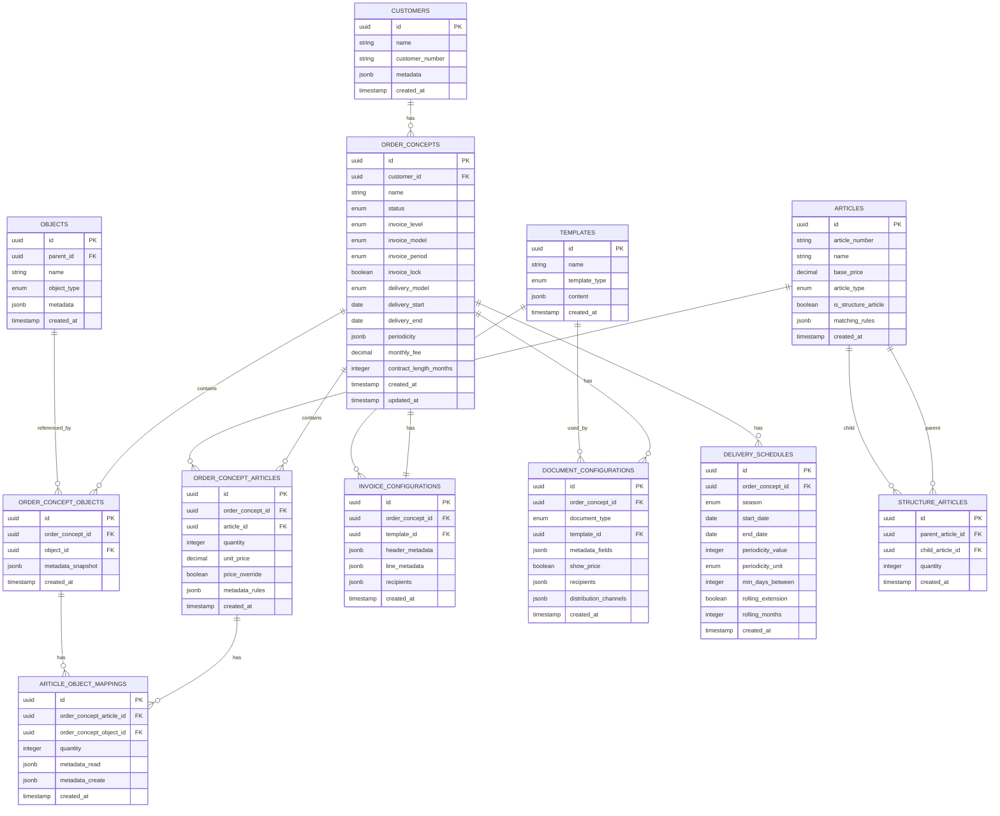
```mermaid
erDiagram
    CUSTOMERS ||--o{ ORDER_CONCEPTS : "has"
    ORDER_CONCEPTS ||--o{ ORDER_CONCEPT_OBJECTS : "contains"
    ORDER_CONCEPTS ||--o{ ORDER_CONCEPT_ARTICLES : "contains"
    ORDER_CONCEPTS ||--|| INVOICE_CONFIGURATIONS : "has"
    ORDER_CONCEPTS ||--o{ DOCUMENT_CONFIGURATIONS : "has"
    ORDER_CONCEPTS ||--o{ DELIVERY_SCHEDULES : "has"
    
    OBJECTS ||--o{ ORDER_CONCEPT_OBJECTS : "referenced_by"
    ARTICLES ||--o{ ORDER_CONCEPT_ARTICLES : "referenced_by"
    ARTICLES ||--o{ STRUCTURE_ARTICLES : "parent"
    ARTICLES ||--o{ STRUCTURE_ARTICLES : "child"
    
    ORDER_CONCEPT_ARTICLES ||--o{ ARTICLE_OBJECT_MAPPINGS : "has"
    ORDER_CONCEPT_OBJECTS ||--o{ ARTICLE_OBJECT_MAPPINGS : "has"
    
    TEMPLATES ||--o{ INVOICE_CONFIGURATIONS : "used_by"
    TEMPLATES ||--o{ DOCUMENT_CONFIGURATIONS : "used_by"
    
    CUSTOMERS {
        uuid id PK
        string name
        string customer_number
        jsonb metadata
        timestamp created_at
    }
    
    ORDER_CONCEPTS {
        uuid id PK
        uuid customer_id FK
        string name
        enum status
        enum invoice_level
        enum invoice_model
        enum invoice_period
        boolean invoice_lock
        enum delivery_model
        date delivery_start
        date delivery_end
        jsonb periodicity
        decimal monthly_fee
        integer contract_length_months
        timestamp created_at
        timestamp updated_at
    }
    
    ORDER_CONCEPT_OBJECTS {
        uuid id PK
        uuid order_concept_id FK
        uuid object_id FK
        jsonb metadata_snapshot
        timestamp created_at
    }
    
    ORDER_CONCEPT_ARTICLES {
        uuid id PK
        uuid order_concept_id FK
        uuid article_id FK
        integer quantity
        decimal unit_price
        boolean price_override
        jsonb metadata_rules
        timestamp created_at
    }
    
    ARTICLE_OBJECT_MAPPINGS {
        uuid id PK
        uuid order_concept_article_id FK
        uuid order_concept_object_id FK
        integer quantity
        jsonb metadata_read
        jsonb metadata_create
        timestamp created_at
    }
    
    OBJECTS {
        uuid id PK
        uuid parent_id FK
        string name
        enum object_type
        jsonb metadata
        timestamp created_at
    }
    
    ARTICLES {
        uuid id PK
        string article_number
        string name
        decimal base_price
        enum article_type
        boolean is_structure_article
        jsonb matching_rules
        timestamp created_at
    }
    
    STRUCTURE_ARTICLES {
        uuid id PK
        uuid parent_article_id FK
        uuid child_article_id FK
        integer quantity
        timestamp created_at
    }
    
    INVOICE_CONFIGURATIONS {
        uuid id PK
        uuid order_concept_id FK
        uuid template_id FK
        jsonb header_metadata
        jsonb line_metadata
        jsonb recipients
        timestamp created_at
    }
    
    DOCUMENT_CONFIGURATIONS {
        uuid id PK
        uuid order_concept_id FK
        enum document_type
        uuid template_id FK
        jsonb metadata_fields
        boolean show_price
        jsonb recipients
        jsonb distribution_channels
        timestamp created_at
    }
    
    DELIVERY_SCHEDULES {
        uuid id PK
        uuid order_concept_id FK
        enum season
        date start_date
        date end_date
        integer periodicity_value
        enum periodicity_unit
        integer min_days_between
        boolean rolling_extension
        integer rolling_months
        timestamp created_at
    }
    
    TEMPLATES {
        uuid id PK
        string name
        enum template_type
        jsonb content
        timestamp created_at
    }
```

## SQL-Scheman

### Tabell: customers

```sql
CREATE TABLE customers (
    id UUID PRIMARY KEY DEFAULT gen_random_uuid(),
    name VARCHAR(255) NOT NULL,
    customer_number VARCHAR(50) UNIQUE,
    organization_number VARCHAR(20),
    email VARCHAR(255),
    phone VARCHAR(50),
    address JSONB,
    invoice_email VARCHAR(255),
    price_list_id UUID,
    fortnox_customer_id VARCHAR(50),
    metadata JSONB DEFAULT '{}',
    active BOOLEAN DEFAULT TRUE,
    created_at TIMESTAMP DEFAULT NOW(),
    updated_at TIMESTAMP DEFAULT NOW()
);

CREATE INDEX idx_customers_name ON customers(name);
CREATE INDEX idx_customers_customer_number ON customers(customer_number);
```

### Tabell: objects

```sql
CREATE TABLE objects (
    id UUID PRIMARY KEY DEFAULT gen_random_uuid(),
    parent_id UUID REFERENCES objects(id),
    customer_id UUID REFERENCES customers(id),
    name VARCHAR(255) NOT NULL,
    object_type VARCHAR(50) NOT NULL, -- 'organizational', 'physical'
    object_subtype VARCHAR(100), -- 'area', 'property', 'room', 'container'
    address JSONB,
    gps_coordinates POINT,
    metadata JSONB DEFAULT '{}',
    inherited_metadata JSONB DEFAULT '{}',
    active BOOLEAN DEFAULT TRUE,
    created_at TIMESTAMP DEFAULT NOW(),
    updated_at TIMESTAMP DEFAULT NOW()
);

CREATE INDEX idx_objects_parent_id ON objects(parent_id);
CREATE INDEX idx_objects_customer_id ON objects(customer_id);
CREATE INDEX idx_objects_type ON objects(object_type);
CREATE INDEX idx_objects_metadata ON objects USING GIN(metadata);
```

### Tabell: articles

```sql
CREATE TABLE articles (
    id UUID PRIMARY KEY DEFAULT gen_random_uuid(),
    article_number VARCHAR(50) UNIQUE NOT NULL,
    name VARCHAR(255) NOT NULL,
    description TEXT,
    base_price DECIMAL(10,2) NOT NULL DEFAULT 0,
    cost_price DECIMAL(10,2) DEFAULT 0,
    unit VARCHAR(20) DEFAULT 'st',
    article_type VARCHAR(50), -- 'service', 'material', 'checkpoint', 'spare_part'
    is_structure_article BOOLEAN DEFAULT FALSE,
    matching_rules JSONB DEFAULT '{}',
    metadata_read JSONB DEFAULT '[]',
    metadata_create JSONB DEFAULT '[]',
    fortnox_article_number VARCHAR(50),
    vat_rate DECIMAL(5,2) DEFAULT 25.00,
    active BOOLEAN DEFAULT TRUE,
    created_at TIMESTAMP DEFAULT NOW(),
    updated_at TIMESTAMP DEFAULT NOW()
);

CREATE INDEX idx_articles_article_number ON articles(article_number);
CREATE INDEX idx_articles_name ON articles(name);
CREATE INDEX idx_articles_type ON articles(article_type);
```

### Tabell: structure_articles

```sql
CREATE TABLE structure_articles (
    id UUID PRIMARY KEY DEFAULT gen_random_uuid(),
    parent_article_id UUID REFERENCES articles(id) ON DELETE CASCADE,
    child_article_id UUID REFERENCES articles(id) ON DELETE CASCADE,
    quantity INTEGER DEFAULT 1,
    sort_order INTEGER DEFAULT 0,
    created_at TIMESTAMP DEFAULT NOW(),
    
    UNIQUE(parent_article_id, child_article_id)
);

CREATE INDEX idx_structure_articles_parent ON structure_articles(parent_article_id);
```

### Tabell: order_concepts

```sql
CREATE TYPE order_concept_status AS ENUM ('draft', 'active', 'completed', 'cancelled');
CREATE TYPE invoice_level AS ENUM ('customer', 'area', 'property', 'object');
CREATE TYPE invoice_model AS ENUM ('call_off', 'schedule', 'subscription');
CREATE TYPE invoice_period AS ENUM ('daily', 'weekly', 'monthly', 'quarterly');
CREATE TYPE delivery_model AS ENUM ('call_off', 'schedule', 'subscription');

CREATE TABLE order_concepts (
    id UUID PRIMARY KEY DEFAULT gen_random_uuid(),
    customer_id UUID REFERENCES customers(id) NOT NULL,
    name VARCHAR(255) NOT NULL,
    description TEXT,
    status order_concept_status DEFAULT 'draft',
    
    -- Fakturering
    invoice_level invoice_level DEFAULT 'customer',
    invoice_model invoice_model DEFAULT 'call_off',
    invoice_period invoice_period DEFAULT 'monthly',
    invoice_lock BOOLEAN DEFAULT FALSE,
    
    -- Leverans
    delivery_model delivery_model DEFAULT 'call_off',
    delivery_start DATE,
    delivery_end DATE,
    periodicity JSONB,
    
    -- Abonnemang
    monthly_fee DECIMAL(10,2),
    contract_length_months INTEGER,
    contract_locked BOOLEAN DEFAULT FALSE,
    
    -- Beställningsmetadata
    order_metadata JSONB DEFAULT '{}',
    
    -- Totaler (beräknade)
    total_objects INTEGER DEFAULT 0,
    total_articles INTEGER DEFAULT 0,
    total_cost DECIMAL(10,2) DEFAULT 0,
    total_value DECIMAL(10,2) DEFAULT 0,
    estimated_hours DECIMAL(5,2) DEFAULT 0,
    
    created_by UUID,
    created_at TIMESTAMP DEFAULT NOW(),
    updated_at TIMESTAMP DEFAULT NOW()
);

CREATE INDEX idx_order_concepts_customer ON order_concepts(customer_id);
CREATE INDEX idx_order_concepts_status ON order_concepts(status);
```

### Tabell: order_concept_objects

```sql
CREATE TABLE order_concept_objects (
    id UUID PRIMARY KEY DEFAULT gen_random_uuid(),
    order_concept_id UUID REFERENCES order_concepts(id) ON DELETE CASCADE,
    object_id UUID REFERENCES objects(id),
    metadata_snapshot JSONB DEFAULT '{}',
    included BOOLEAN DEFAULT TRUE,
    sort_order INTEGER DEFAULT 0,
    created_at TIMESTAMP DEFAULT NOW(),
    
    UNIQUE(order_concept_id, object_id)
);

CREATE INDEX idx_oco_order_concept ON order_concept_objects(order_concept_id);
CREATE INDEX idx_oco_object ON order_concept_objects(object_id);
```

### Tabell: order_concept_articles

```sql
CREATE TABLE order_concept_articles (
    id UUID PRIMARY KEY DEFAULT gen_random_uuid(),
    order_concept_id UUID REFERENCES order_concepts(id) ON DELETE CASCADE,
    article_id UUID REFERENCES articles(id),
    quantity INTEGER DEFAULT 1,
    unit_price DECIMAL(10,2),
    price_override BOOLEAN DEFAULT FALSE,
    metadata_rules JSONB DEFAULT '{}',
    sort_order INTEGER DEFAULT 0,
    created_at TIMESTAMP DEFAULT NOW(),
    
    UNIQUE(order_concept_id, article_id)
);

CREATE INDEX idx_oca_order_concept ON order_concept_articles(order_concept_id);
CREATE INDEX idx_oca_article ON order_concept_articles(article_id);
```

### Tabell: article_object_mappings

```sql
CREATE TABLE article_object_mappings (
    id UUID PRIMARY KEY DEFAULT gen_random_uuid(),
    order_concept_article_id UUID REFERENCES order_concept_articles(id) ON DELETE CASCADE,
    order_concept_object_id UUID REFERENCES order_concept_objects(id) ON DELETE CASCADE,
    quantity INTEGER DEFAULT 1,
    metadata_read JSONB DEFAULT '{}',
    metadata_create JSONB DEFAULT '{}',
    created_at TIMESTAMP DEFAULT NOW(),
    
    UNIQUE(order_concept_article_id, order_concept_object_id)
);

CREATE INDEX idx_aom_article ON article_object_mappings(order_concept_article_id);
CREATE INDEX idx_aom_object ON article_object_mappings(order_concept_object_id);
```

### Tabell: invoice_configurations

```sql
CREATE TABLE invoice_configurations (
    id UUID PRIMARY KEY DEFAULT gen_random_uuid(),
    order_concept_id UUID REFERENCES order_concepts(id) ON DELETE CASCADE UNIQUE,
    template_id UUID REFERENCES templates(id),
    header_metadata JSONB DEFAULT '[]',
    line_metadata JSONB DEFAULT '[]',
    recipients JSONB DEFAULT '[]',
    show_prices BOOLEAN DEFAULT TRUE,
    payment_terms_days INTEGER DEFAULT 30,
    fortnox_export_enabled BOOLEAN DEFAULT TRUE,
    created_at TIMESTAMP DEFAULT NOW(),
    updated_at TIMESTAMP DEFAULT NOW()
);
```

### Tabell: document_configurations

```sql
CREATE TYPE document_type AS ENUM ('order_confirmation', 'delivery_note', 'invoice');
CREATE TYPE distribution_channel AS ENUM ('email', 'portal', 'sms', 'print');

CREATE TABLE document_configurations (
    id UUID PRIMARY KEY DEFAULT gen_random_uuid(),
    order_concept_id UUID REFERENCES order_concepts(id) ON DELETE CASCADE,
    document_type document_type NOT NULL,
    enabled BOOLEAN DEFAULT TRUE,
    template_id UUID REFERENCES templates(id),
    metadata_fields JSONB DEFAULT '[]',
    show_price BOOLEAN DEFAULT TRUE,
    recipients JSONB DEFAULT '[]',
    distribution_channels distribution_channel[] DEFAULT '{}',
    created_at TIMESTAMP DEFAULT NOW(),
    updated_at TIMESTAMP DEFAULT NOW(),
    
    UNIQUE(order_concept_id, document_type)
);
```

### Tabell: delivery_schedules

```sql
CREATE TYPE season AS ENUM ('spring', 'summer', 'fall', 'winter');
CREATE TYPE periodicity_unit AS ENUM ('days', 'weeks', 'months');

CREATE TABLE delivery_schedules (
    id UUID PRIMARY KEY DEFAULT gen_random_uuid(),
    order_concept_id UUID REFERENCES order_concepts(id) ON DELETE CASCADE,
    season season,
    start_date DATE,
    end_date DATE,
    periodicity_value INTEGER DEFAULT 1,
    periodicity_unit periodicity_unit DEFAULT 'months',
    min_days_between INTEGER DEFAULT 60,
    preferred_weekday INTEGER, -- 0=Måndag, 6=Söndag
    preferred_time_from TIME,
    preferred_time_to TIME,
    rolling_extension BOOLEAN DEFAULT TRUE,
    rolling_months INTEGER DEFAULT 12,
    active BOOLEAN DEFAULT TRUE,
    created_at TIMESTAMP DEFAULT NOW(),
    
    UNIQUE(order_concept_id, season)
);

CREATE INDEX idx_ds_order_concept ON delivery_schedules(order_concept_id);
```

### Tabell: templates

```sql
CREATE TYPE template_type AS ENUM ('invoice', 'order_confirmation', 'delivery_note', 'email');

CREATE TABLE templates (
    id UUID PRIMARY KEY DEFAULT gen_random_uuid(),
    name VARCHAR(255) NOT NULL,
    template_type template_type NOT NULL,
    content JSONB NOT NULL,
    html_template TEXT,
    is_default BOOLEAN DEFAULT FALSE,
    customer_id UUID REFERENCES customers(id), -- NULL = global
    active BOOLEAN DEFAULT TRUE,
    created_at TIMESTAMP DEFAULT NOW(),
    updated_at TIMESTAMP DEFAULT NOW()
);

CREATE INDEX idx_templates_type ON templates(template_type);
CREATE INDEX idx_templates_customer ON templates(customer_id);
```

---

# Del 6: API-Design

## REST API Endpoints

### Order Concepts

#### Skapa orderkoncept
```
POST /api/order-concepts

Request Body:
{
  "customer_id": "uuid",
  "name": "Vårtvätt 2026",
  "description": "Kärltvätt för Familjebostäder Södermalm"
}

Response: 201 Created
{
  "id": "uuid",
  "customer_id": "uuid",
  "name": "Vårtvätt 2026",
  "status": "draft",
  ...
}
```

#### Hämta orderkoncept
```
GET /api/order-concepts/:id

Response: 200 OK
{
  "id": "uuid",
  "customer": { ... },
  "objects": [ ... ],
  "articles": [ ... ],
  "invoice_config": { ... },
  "document_configs": [ ... ],
  "delivery_schedules": [ ... ],
  "totals": {
    "objects": 47,
    "articles": 5,
    "cost": 3200,
    "value": 5425,
    "estimated_hours": 12
  }
}
```

#### Lista orderkoncept
```
GET /api/order-concepts?customer_id={id}&status={status}&page={page}

Response: 200 OK
{
  "data": [ ... ],
  "pagination": {
    "page": 1,
    "per_page": 20,
    "total": 150
  }
}
```

#### Uppdatera orderkoncept
```
PUT /api/order-concepts/:id

Request Body:
{
  "name": "Vårtvätt 2026 - Uppdaterad",
  "invoice_level": "area",
  "invoice_model": "schedule"
}

Response: 200 OK
```

### Objekt

#### Lägg till objekt
```
POST /api/order-concepts/:id/objects

Request Body:
{
  "object_ids": ["uuid1", "uuid2", "uuid3"]
}

Response: 201 Created
```

#### Ta bort objekt
```
DELETE /api/order-concepts/:id/objects/:objectId

Response: 204 No Content
```

#### Importera objekt från fil
```
POST /api/order-concepts/:id/objects/import

Request Body: multipart/form-data
- file: CSV/Excel-fil
- mapping: { "address": "column_a", "property_number": "column_b" }

Response: 200 OK
{
  "matched": 45,
  "partial_match": 5,
  "not_found": 3,
  "objects": [ ... ]
}
```

### Artiklar

#### Lägg till artiklar
```
POST /api/order-concepts/:id/articles

Request Body:
{
  "articles": [
    { "article_id": "uuid", "quantity": 1 },
    { "article_id": "uuid", "quantity": 28, "unit_price": 150 }
  ]
}

Response: 201 Created
```

#### Skapa artikel-objekt-kopplingar
```
POST /api/order-concepts/:id/article-mappings/auto

Response: 200 OK
{
  "mappings_created": 47,
  "unmatched_articles": [],
  "unmatched_objects": []
}
```

#### Manuell koppling
```
POST /api/order-concepts/:id/article-mappings

Request Body:
{
  "order_concept_article_id": "uuid",
  "order_concept_object_id": "uuid",
  "quantity": 1
}

Response: 201 Created
```

### Konfigurationer

#### Uppdatera fakturakonfiguration
```
PUT /api/order-concepts/:id/invoice-config

Request Body:
{
  "template_id": "uuid",
  "header_metadata": ["avdelningsnummer", "kostnadsställe"],
  "line_metadata": ["fastighetsnummer", "objektidentitet"],
  "recipients": [
    { "email": "ekonomi@familje.se", "type": "invoice" }
  ]
}

Response: 200 OK
```

#### Uppdatera dokumentkonfiguration
```
PUT /api/order-concepts/:id/documents

Request Body:
{
  "documents": [
    {
      "document_type": "order_confirmation",
      "enabled": true,
      "show_price": true,
      "distribution_channels": ["email", "portal"]
    },
    {
      "document_type": "delivery_note",
      "enabled": true,
      "show_price": false,
      "distribution_channels": ["email"]
    }
  ]
}

Response: 200 OK
```

#### Uppdatera leveransmodell
```
PUT /api/order-concepts/:id/delivery

Request Body:
{
  "delivery_model": "schedule",
  "schedules": [
    {
      "season": "spring",
      "start_date": "2026-02-01",
      "end_date": "2026-04-30"
    },
    {
      "season": "summer",
      "start_date": "2026-05-01",
      "end_date": "2026-07-31"
    }
  ],
  "min_days_between": 60,
  "rolling_extension": true,
  "rolling_months": 12
}

Response: 200 OK
```

### Validering och Aktivering

#### Validera orderkoncept
```
POST /api/order-concepts/:id/validate

Response: 200 OK
{
  "valid": true,
  "errors": [],
  "warnings": [
    { "code": "MISSING_ACCESS_CODE", "object_id": "uuid", "message": "Objekt saknar kodlås" }
  ]
}
```

#### Aktivera orderkoncept
```
POST /api/order-concepts/:id/activate

Response: 200 OK
{
  "tasks_created": 47,
  "invoices_scheduled": 2,
  "next_execution": "2026-03-15"
}
```

### Sök och Hjälpresurser

#### Sök objekt
```
GET /api/objects/search?q={query}&customer_id={id}&type={type}

Response: 200 OK
{
  "data": [ ... ],
  "total": 150
}
```

#### Hämta objektträd
```
GET /api/objects/tree?root_id={id}

Response: 200 OK
{
  "id": "uuid",
  "name": "Familjebostäder",
  "children": [
    {
      "id": "uuid",
      "name": "Södermalm",
      "children": [ ... ]
    }
  ]
}
```

#### Sök artiklar
```
GET /api/articles?search={query}&type={type}

Response: 200 OK
{
  "data": [ ... ]
}
```

#### Hämta strukturartikel
```
GET /api/articles/:id/structure

Response: 200 OK
{
  "id": "uuid",
  "name": "Komplett Kärltvätt",
  "base_price": 850,
  "children": [
    { "id": "uuid", "name": "Etablering", "quantity": 1, "price": 50 },
    { "id": "uuid", "name": "Tvätt per kärl", "quantity": 1, "price": 150 },
    ...
  ]
}
```

---

# Del 7: UI-Flöde

## Wizard-struktur

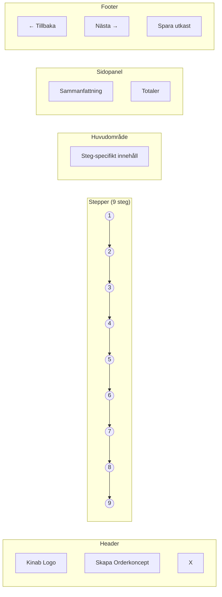
```mermaid
flowchart LR
    subgraph Header["Header"]
        Logo[Kinab Logo]
        Title[Skapa Orderkoncept]
        Close[X]
    end
    
    subgraph Stepper["Stepper (9 steg)"]
        S1((1))
        S2((2))
        S3((3))
        S4((4))
        S5((5))
        S6((6))
        S7((7))
        S8((8))
        S9((9))
    end
    
    subgraph Main["Huvudområde"]
        Content[Steg-specifikt innehåll]
    end
    
    subgraph Sidebar["Sidopanel"]
        Summary[Sammanfattning]
        Totals[Totaler]
    end
    
    subgraph Footer["Footer"]
        Back[← Tillbaka]
        Next[Nästa →]
        Save[Spara utkast]
    end
    
    S1 --> S2 --> S3 --> S4 --> S5 --> S6 --> S7 --> S8 --> S9
```

## Wireframes per Steg

### Steg 1: Val av Objekt

```
┌────────────────────────────────────────────────────────────────────────┐
│ ← Tillbaka                    STEG 1 AV 9                              │
│                         Val av Kund, Kluster eller Objekt               │
├────────────────────────────────────────────────────────────────────────┤
│                                                                         │
│  ┌─────────────────────────────────────────────────────────────────┐   │
│  │ 🔍 Sök kund... [Familjebostäder                            ] ▼  │   │
│  └─────────────────────────────────────────────────────────────────┘   │
│                                                                         │
│  ┌───────────────────────────────────┬─────────────────────────────┐   │
│  │ OBJEKTHIERARKI                    │ SAMMANFATTNING               │   │
│  │                                   │                              │   │
│  │ ▼ ☐ Familjebostäder              │ Valda objekt: 47             │   │
│  │   ▼ ☑ Stockholm                  │ Kluster: 4                   │   │
│  │     ▼ ☑ Södermalm                │                              │   │
│  │       ▶ ☑ Palmgatan 17           │ ─────────────────            │   │
│  │       ▶ ☑ Hornsgatan 55          │                              │   │
│  │       ▶ ☑ Götgatan 100           │ [Importera från fil]         │   │
│  │     ▶ ☐ Norrmalm                 │                              │   │
│  │   ▶ ☐ Göteborg                   │                              │   │
│  │                                   │                              │   │
│  └───────────────────────────────────┴─────────────────────────────┘   │
│                                                                         │
├────────────────────────────────────────────────────────────────────────┤
│                                            [Spara utkast] [Nästa →]    │
└────────────────────────────────────────────────────────────────────────┘
```

### Steg 2: Bekräftelse och Urval

```
┌────────────────────────────────────────────────────────────────────────┐
│ ← Tillbaka                    STEG 2 AV 9                              │
│                       Bekräftelse och Urval av Objekt                   │
├────────────────────────────────────────────────────────────────────────┤
│                                                                         │
│  ┌─────────────────────────────────────────────────────────────────┐   │
│  │ Filter: [Alla typer ▼] [Alla status ▼] [Sök...              ]   │   │
│  └─────────────────────────────────────────────────────────────────┘   │
│                                                                         │
│  ┌─────────────────────────────────────────────────────────────────┐   │
│  │ ☑ │ OBJEKT                │ TYP      │ ADRESS          │ ANTAL │   │
│  │───┼───────────────────────┼──────────┼─────────────────┼───────│   │
│  │ ☑ │ Miljörum A            │ Rum      │ Palmgatan 17    │ 15    │   │
│  │ ☑ │ Soprum B              │ Rum      │ Hornsgatan 55   │ 8     │   │
│  │ ⚠ │ Återvinning C         │ Rum      │ Götgatan 100    │ 12    │   │
│  │ ☑ │ Miljörum D            │ Rum      │ Folkungagatan 23│ 10    │   │
│  │ ☑ │ Återvinning E         │ Rum      │ Ringvägen 15    │ 6     │   │
│  │   │ ...                   │          │                 │       │   │
│  └─────────────────────────────────────────────────────────────────┘   │
│                                                                         │
│  [Välj alla] [Avmarkera alla]                    Visar 47 av 47 objekt │
│                                                                         │
├────────────────────────────────────────────────────────────────────────┤
│                               [← Tillbaka] [Spara utkast] [Nästa →]    │
└────────────────────────────────────────────────────────────────────────┘
```

### Steg 3: Fakturamodell

```
┌────────────────────────────────────────────────────────────────────────┐
│ ← Tillbaka                    STEG 3 AV 9                              │
│                     Fakturamodell och Faktureringsstruktur              │
├────────────────────────────────────────────────────────────────────────┤
│                                                                         │
│  ┌─────────────────────────────────────┬───────────────────────────┐   │
│  │ KUND IDENTIFIERAD                   │ FÖRHANDSVISNING           │   │
│  │ ───────────────────────             │                           │   │
│  │ Familjebostäder AB (1001)          │ Med vald nivå (Område):   │   │
│  │ Kontakt: Anna Förvaltare            │                           │   │
│  │ Objekt: 47 st                       │ 📄 Faktura 1: Södermalm  │   │
│  │                                     │    35 objekt, 4 200 kr   │   │
│  │ FAKTURERINGSNIVÅ                    │                           │   │
│  │ ───────────────────                 │ 📄 Faktura 2: Norrmalm   │   │
│  │ ⚪ Kundnivå    (1 faktura)          │    12 objekt, 1 225 kr   │   │
│  │ ● Område      (2 fakturor)         │                           │   │
│  │ ⚪ Fastighet   (8 fakturor)         │ ─────────────────         │   │
│  │ ⚪ Objekt      (47 fakturor)        │ Totalt: 2 fakturor       │   │
│  │                                     │         5 425 kr         │   │
│  │ FAKTURAMODELL                       │                           │   │
│  │ ● Avrop (efterfakturering)         │                           │   │
│  │ ⚪ Schema (efterfakturering)        │                           │   │
│  │ ⚪ Abonnemang (månadsfakturering)   │                           │   │
│  │                                     │                           │   │
│  │ FAKTURERINGSPERIOD                  │                           │   │
│  │ [Månadsvis ▼]                       │                           │   │
│  │                                     │                           │   │
│  │ ☐ Faktureringslåsning               │                           │   │
│  └─────────────────────────────────────┴───────────────────────────┘   │
│                                                                         │
├────────────────────────────────────────────────────────────────────────┤
│                               [← Tillbaka] [Spara utkast] [Nästa →]    │
└────────────────────────────────────────────────────────────────────────┘
```

### Steg 6: Artiklar (Exempel)

```
┌────────────────────────────────────────────────────────────────────────┐
│ ← Tillbaka                    STEG 6 AV 9                              │
│                        Skapande av Uppgifter och Artiklar               │
├────────────────────────────────────────────────────────────────────────┤
│                                                                         │
│  ┌─────────────────────────────────────────────────────────────────┐   │
│  │ 🔍 Sök artikel... [Tvätta                                     ] │   │
│  └─────────────────────────────────────────────────────────────────┘   │
│                                                                         │
│  SNABBVAL:                                                              │
│  [Komplett Kärltvätt] [Besiktning] [Reparation] [Byte av lock]         │
│                                                                         │
│  ┌─────────────────────────────────────┬───────────────────────────┐   │
│  │ VALDA ARTIKLAR                      │ SAMMANFATTNING            │   │
│  │                                     │                           │   │
│  │ ▼ Komplett Kärltvätt      850 kr   │ Artiklar: 3               │   │
│  │   ├ Etablering             50 kr   │ Totalt värde: 5 425 kr    │   │
│  │   ├ Tvätt matavfall × 28 4 200 kr   │                           │   │
│  │   ├ Fotografering          75 kr   │ Prislista:                │   │
│  │   └ Kontrollpunkt           0 kr   │ Familjebostäder 2026      │   │
│  │                                     │                           │   │
│  │ Besiktning dörr           150 kr   │                           │   │
│  │ Besiktning fönster        100 kr   │                           │   │
│  │                                     │                           │   │
│  │                                     │                           │   │
│  │                                     │                           │   │
│  │ ──────────────────────────────────  │                           │   │
│  │ TOTAL:                  5 425 kr   │                           │   │
│  └─────────────────────────────────────┴───────────────────────────┘   │
│                                                                         │
├────────────────────────────────────────────────────────────────────────┤
│                               [← Tillbaka] [Spara utkast] [Nästa →]    │
└────────────────────────────────────────────────────────────────────────┘
```

### Steg 9: Leveransmodell

```
┌────────────────────────────────────────────────────────────────────────┐
│ ← Tillbaka                    STEG 9 AV 9                              │
│                              Leveransmodell                             │
├────────────────────────────────────────────────────────────────────────┤
│                                                                         │
│  VÄLJ LEVERANSMODELL:                                                   │
│  ┌──────────────┐ ┌──────────────┐ ┌──────────────┐                    │
│  │    AVROP     │ │ ● SCHEMA    │ │  ABONNEMANG  │                    │
│  │  Engångs-    │ │ Återkommande │ │   Fast       │                    │
│  │  beställning │ │ enligt plan  │ │   månads-    │                    │
│  │              │ │              │ │   avgift     │                    │
│  └──────────────┘ └──────────────┘ └──────────────┘                    │
│                                                                         │
│  ┌─────────────────────────────────────────────────────────────────┐   │
│  │ SCHEMAKONFIGURATION                                              │   │
│  │                                                                  │   │
│  │ Säsonger:                                                        │   │
│  │ ☑ Vår (feb-apr)   ☑ Sommar (maj-jul)   ☑ Höst (sep-nov)         │   │
│  │                                                                  │   │
│  │ Startdatum: [2026-03-01]                                        │   │
│  │                                                                  │   │
│  │ Slutdatum:  ☑ Rullande förlängning [12] månader                 │   │
│  │                                                                  │   │
│  │ Minsta avstånd mellan uppdrag: [60] dagar                       │   │
│  └─────────────────────────────────────────────────────────────────┘   │
│                                                                         │
│  ┌─────────────────────────────────────────────────────────────────┐   │
│  │ PLANERADE UPPDRAG                                                │   │
│  │ ────────────────                                                 │   │
│  │ 📅 Mars 2026:     Vårtvätt Södermalm (28 kärl)                  │   │
│  │ 📅 Juni 2026:     Sommartvätt Södermalm (28 kärl)               │   │
│  │ 📅 Oktober 2026:  Hösttvätt Södermalm (28 kärl)                 │   │
│  │ 📅 Mars 2027:     Vårtvätt Södermalm [automatisk]               │   │
│  └─────────────────────────────────────────────────────────────────┘   │
│                                                                         │
├────────────────────────────────────────────────────────────────────────┤
│                    [← Tillbaka] [Spara utkast] [Skapa Orderkoncept]    │
└────────────────────────────────────────────────────────────────────────┘
```

---

# Del 8: Affärslogik och Regler

## Regel 1: Metadata-matchning

### Exakt matchning

```
IF artikel.matching_rules.type == objekt.metadata.type
THEN skapa_koppling(artikel, objekt)
```

### Fuzzy matchning (adresser)

```
IF levenshtein_distance(import_address, objekt.address) / max_length < 0.2
THEN föreslå_matchning(import_address, objekt, confidence=0.8)
```

### Attributbaserad matchning

```
IF artikel.matching_rules.storlek_min <= objekt.metadata.storlek <= artikel.matching_rules.storlek_max
THEN skapa_koppling(artikel, objekt)
```

## Regel 2: Prisberäkning

### Prioriteringsordning

```
function beräkna_pris(artikel, objekt, orderkoncept):
    // 1. Manuellt pris (högst prioritet)
    IF orderkoncept_artikel.price_override == TRUE:
        RETURN orderkoncept_artikel.unit_price
    
    // 2. Kundspecifik prislista
    kundpris = hämta_kundpris(artikel, orderkoncept.customer)
    IF kundpris EXISTS:
        RETURN kundpris
    
    // 3. Standardprislista
    RETURN artikel.base_price
```

### Strukturartikel-priser

```
function beräkna_strukturpris(strukturartikel, antal):
    IF strukturartikel.price_type == 'fixed':
        RETURN strukturartikel.base_price * antal
    ELSE:
        total = 0
        FOR child IN strukturartikel.children:
            total += child.price * child.quantity * antal
        RETURN total
```

## Regel 3: Faktureringslåsning

```
function skapa_faktura(orderkoncept, artiklar):
    IF orderkoncept.invoice_lock == TRUE:
        olevererade = artiklar.filter(a => a.status != 'completed')
        IF olevererade.length > 0:
            RETURN { status: 'locked', waiting_for: olevererade }
    
    RETURN generera_faktura(artiklar)
```

## Regel 4: Faktureringsnivåer

```
function gruppera_för_fakturering(orderkoncept, artiklar):
    SWITCH orderkoncept.invoice_level:
        CASE 'customer':
            RETURN [{ kund: orderkoncept.customer, artiklar: artiklar }]
        
        CASE 'area':
            RETURN gruppera_per_område(artiklar)
        
        CASE 'property':
            RETURN gruppera_per_fastighet(artiklar)
        
        CASE 'object':
            RETURN artiklar.map(a => { objekt: a.object, artiklar: [a] })
```

## Regel 5: Abonnemangsberäkning

```
function beräkna_månadsavgift(orderkoncept):
    total_årskostnad = 0
    
    FOR artikel IN orderkoncept.artiklar:
        FOR objekt IN artikel.kopplade_objekt:
            antal = objekt.metadata.antal ?? 1
            pris = beräkna_pris(artikel, objekt)
            frekvens = orderkoncept.delivery_schedules.length
            
            total_årskostnad += antal * pris * frekvens
    
    RETURN total_årskostnad / 12
```

## Regel 6: Rullande förlängning

```
function kör_rullande_förlängning():
    // Körs veckovis
    orderkoncept = hämta_alla_aktiva_schema_ordrar()
    
    FOR order IN orderkoncept:
        IF order.rolling_extension == FALSE:
            CONTINUE
        
        sista_planerade = hämta_sista_planerade_uppgift(order)
        månader_kvar = diff_månader(sista_planerade, NOW())
        
        IF månader_kvar < order.rolling_months / 2:
            // Skapa nästa period
            nästa_säsong = beräkna_nästa_säsong(order)
            skapa_uppgifter_för_säsong(order, nästa_säsong)
```

## Regel 7: Minsta avstånd

```
function validera_leveransplanering(orderkoncept, ny_leverans):
    senaste = hämta_senaste_leverans(orderkoncept, ny_leverans.objekt)
    
    IF senaste EXISTS:
        dagar_sedan = diff_dagar(senaste.datum, ny_leverans.datum)
        
        IF dagar_sedan < orderkoncept.min_days_between:
            IF ny_leverans.status != 'akut':
                RETURN {
                    valid: FALSE,
                    error: f"För kort tid sedan senaste ({dagar_sedan} dagar)"
                }
    
    RETURN { valid: TRUE }
```

## Regel 8: Avtalsspärr

```
function validera_abonnemangsändring(orderkoncept, ny_månadsavgift):
    IF orderkoncept.customer.type == 'public_sector':
        IF orderkoncept.contract_locked == TRUE:
            tid_kvar = diff_dagar(NOW(), orderkoncept.delivery_end)
            
            IF tid_kvar > 0:
                RETURN {
                    valid: FALSE,
                    error: "Offentlig kund - avgift kan inte ändras under avtalsperiod",
                    nästa_möjliga_ändring: orderkoncept.delivery_end
                }
    
    RETURN { valid: TRUE }
```

## Regel 9: Metadata-arv

```
function hämta_effektiv_metadata(objekt, metadata_typ):
    // Kolla om objektet har egen metadata
    IF objekt.metadata[metadata_typ] EXISTS:
        RETURN objekt.metadata[metadata_typ]
    
    // Annars, kolla förälder (rekursivt)
    IF objekt.parent EXISTS:
        förälder_meta = hämta_effektiv_metadata(objekt.parent, metadata_typ)
        
        // Kontrollera nivålås
        IF förälder_meta.nivålås == TRUE:
            RETURN NULL
        
        RETURN förälder_meta
    
    RETURN NULL
```

## Regel 10: Dokumentgenerering

```
function generera_dokument(orderkoncept, dokumenttyp):
    config = orderkoncept.document_configurations[dokumenttyp]
    
    IF config.enabled == FALSE:
        RETURN NULL
    
    mall = hämta_mall(config.template_id)
    
    data = {
        orderkoncept: orderkoncept,
        objekt: orderkoncept.objects,
        artiklar: orderkoncept.articles,
        metadata: hämta_konfigurerad_metadata(config.metadata_fields),
        visa_pris: config.show_price
    }
    
    pdf = rendera_pdf(mall, data)
    
    FOR kanal IN config.distribution_channels:
        distribuera(pdf, kanal, config.recipients)
    
    RETURN pdf
```

---

# Del 9: Integrationskrav

## 9.1 Fortnox Integration

### Artikelsynkronisering

| Fält i Kinab | Fält i Fortnox | Riktning |
|--------------|----------------|----------|
| article_number | ArticleNumber | Kinab → Fortnox |
| name | Description | Kinab → Fortnox |
| base_price | SalesPrice | Kinab → Fortnox |
| cost_price | PurchasePrice | Kinab → Fortnox |
| unit | Unit | Kinab → Fortnox |
| vat_rate | VAT | Kinab → Fortnox |

### Kundsynkronisering

| Fält i Kinab | Fält i Fortnox | Riktning |
|--------------|----------------|----------|
| customer_number | CustomerNumber | Båda |
| name | Name | Kinab → Fortnox |
| invoice_email | EmailInvoice | Kinab → Fortnox |
| address | Address1, Address2, ZipCode, City | Kinab → Fortnox |
| organization_number | OrganisationNumber | Kinab → Fortnox |

### Fakturaexport

```json
{
  "CustomerNumber": "1001",
  "InvoiceRows": [
    {
      "ArticleNumber": "TVÄTT-MAT-125L",
      "Description": "Tvätt matavfallskärl 125L - Palmgatan 17",
      "DeliveredQuantity": 10,
      "Price": 150,
      "RowId": 1
    }
  ],
  "YourReference": "Anna Förvaltare",
  "OurReference": "Beställning 22",
  "InvoiceDate": "2026-03-31",
  "DueDate": "2026-04-30"
}
```

### API-integration

| Endpoint | Användning | Frekvens |
|----------|------------|----------|
| POST /invoices | Skapa faktura | Vid fakturering |
| GET /invoices/{id} | Kontrollera status | Vid behov |
| GET /customers | Synkronisera kunder | Dagligen |
| POST /articles | Skapa/uppdatera artiklar | Vid ändring |

## 9.2 Kundportal Integration

### Publicering av Dokument

| Dokument | Automatisk publicering | Avisering |
|----------|------------------------|-----------|
| Orderbekräftelse | Ja | E-post |
| Följesedel | Nej | - |
| Faktura | Ja | E-post + SMS |

### API-endpoints

```
POST /api/portal/documents
- Publicera nytt dokument

GET /api/portal/documents?customer_id={id}
- Lista kundens dokument

GET /api/portal/documents/:id/download
- Ladda ner dokument
```

### Webhooks

| Event | Payload |
|-------|---------|
| document.published | { document_id, customer_id, type } |
| invoice.paid | { invoice_id, payment_date, amount } |
| customer.viewed | { customer_id, document_id, timestamp } |

## 9.3 E-post (SendGrid)

### Mallar

| Mall | Användning |
|------|------------|
| order_confirmation | Orderbekräftelse |
| invoice_ready | Ny faktura tillgänglig |
| task_completed | Uppdrag slutfört |
| reminder | Betalningspåminnelse |

### API

```javascript
const sgMail = require('@sendgrid/mail');

async function sendInvoiceNotification(customer, invoice) {
  const msg = {
    to: customer.invoice_email,
    from: 'faktura@kinab.se',
    templateId: 'd-invoice-ready-template',
    dynamicTemplateData: {
      customer_name: customer.name,
      invoice_number: invoice.number,
      amount: invoice.total,
      due_date: invoice.due_date,
      portal_link: `https://portal.kinab.se/invoices/${invoice.id}`
    }
  };
  
  await sgMail.send(msg);
}
```

## 9.4 SMS (Twilio)

### Meddelandetyper

| Typ | Mall |
|-----|------|
| Avisering | "Hej {namn}! En ny faktura på {belopp} kr finns nu på din kundportal." |
| Påminnelse | "Påminnelse: Faktura {nr} förfaller {datum}. Se portal.kinab.se" |
| Bekräftelse | "Ditt uppdrag är klart! Rapport finns på portal.kinab.se" |

---

# Del 10: Komplexitet och Utmaningar

## Utmaning 1: Metadata-matchning vid Import

### Problem

När användare importerar adresser från Excel kan samma adress skrivas på många olika sätt:
- "Palmgatan 17"
- "Palmg. 17"
- "Palmgatan 17, 118 26 Stockholm"
- "Palmgatan 17 A"

### Lösning

```mermaid
flowchart TB
    A[Importerad adress] --> B[Normalisering]
    B --> C[Exakt matchning]
    C --> D{Match?}
    D -->|Ja| E[✓ Koppling skapad]
    D -->|Nej| F[Fuzzy matchning]
    F --> G{Konfidenspoäng > 0.8?}
    G -->|Ja| H[Förslag till användare]
    G -->|Nej| I[Markera som ej matchad]
    H --> J{Användare bekräftar?}
    J -->|Ja| E
    J -->|Nej| I
```

### Implementation

1. **Normalisering:** Ta bort extra mellanslag, konvertera till lowercase, expandera förkortningar
2. **Exakt matchning:** Jämför normaliserade strängar
3. **Fuzzy matchning:** Använd Levenshtein-avstånd eller Jaro-Winkler
4. **Konfidenspoäng:** Beräkna 0-1 baserat på likhet
5. **Användarbekräftelse:** Visa förslag med osäkra matchningar

## Utmaning 2: Strukturartiklar med Dynamisk Prissättning

### Problem

Strukturartiklar (paket) kan ha:
- Fast pris för hela paketet
- Summa av ingående artiklar
- Kundspecifika priser på delar
- Manuella överskrivningar

### Lösning

```mermaid
flowchart TB
    SA[Strukturartikel] --> PT{Pristyp?}
    PT -->|Fast| FP[Returnera fast pris]
    PT -->|Summa| SP[Summera delar]
    
    SP --> |För varje del| PD[Prisberäkning]
    PD --> KP{Kundpris?}
    KP -->|Ja| UK[Använd kundpris]
    KP -->|Nej| BP[Använd baspris]
    UK --> SUM[Summera]
    BP --> SUM
    SUM --> TOT[Total]
    
    FP --> MO{Manuell override?}
    TOT --> MO
    MO -->|Ja| MOP[Använd manuellt pris]
    MO -->|Nej| FINAL[Slutpris]
    MOP --> FINAL
```

### Datamodell

```sql
-- Strukturartikel med prislogik
CREATE TABLE structure_articles (
    id UUID PRIMARY KEY,
    parent_article_id UUID REFERENCES articles(id),
    child_article_id UUID REFERENCES articles(id),
    quantity INTEGER DEFAULT 1,
    price_contribution DECIMAL(10,2), -- Om NULL, använd child_article.price
    include_in_sum BOOLEAN DEFAULT TRUE
);

-- Orderkoncept-artikel med override
CREATE TABLE order_concept_articles (
    id UUID PRIMARY KEY,
    article_id UUID REFERENCES articles(id),
    unit_price DECIMAL(10,2), -- Manuell override
    price_override BOOLEAN DEFAULT FALSE,
    price_calculation_method VARCHAR(20) -- 'fixed', 'sum', 'manual'
);
```

## Utmaning 3: Faktureringsnivåer i Hierarki

### Problem

Samma objekt kan ha olika "stopp-nivåer" för fakturering beroende på kundens önskemål:
- Kund A vill ha en faktura per område
- Kund B vill ha en faktura per fastighet
- Kund C vill ha allt på en faktura

### Lösning

```mermaid
flowchart TB
    OC[Orderkoncept] --> IL{Invoice Level?}
    
    IL -->|customer| CL[Gruppera alla under kund]
    IL -->|area| AL[Gruppera per område]
    IL -->|property| PL[Gruppera per fastighet]
    IL -->|object| OL[En per objekt]
    
    CL --> GEN[Generera fakturor]
    AL --> GEN
    PL --> GEN
    OL --> GEN
    
    GEN --> FX[Export till Fortnox]
```

### Implementation

```javascript
function grupperaFörFakturering(orderkoncept) {
  const { invoice_level, objects, articles } = orderkoncept;
  
  // Hämta alla artikel-objekt-kopplingar
  const kopplingar = articles.flatMap(a => 
    a.mappings.map(m => ({
      artikel: a,
      objekt: m.object,
      hierarki: hämtaHierarki(m.object)
    }))
  );
  
  // Gruppera baserat på nivå
  switch (invoice_level) {
    case 'customer':
      return [{ kund: orderkoncept.customer, rader: kopplingar }];
    
    case 'area':
      return Object.values(groupBy(kopplingar, k => k.hierarki.area?.id));
    
    case 'property':
      return Object.values(groupBy(kopplingar, k => k.hierarki.property?.id));
    
    case 'object':
      return kopplingar.map(k => [k]);
  }
}
```

## Utmaning 4: Rullande Förlängning med Tidsfönster

### Problem

Orderkoncept med "Schema" ska automatiskt skapa nya uppgifter för framtida perioder, men:
- Respektera kundens tidsfönster (vår, sommar, höst)
- Hålla minsta avstånd mellan uppdrag
- Inte skapa duplikat

### Lösning

```mermaid
sequenceDiagram
    participant Cron as Veckovis Cron
    participant System as Modus/Kinab
    participant DB as Databas
    
    Cron->>System: Kör rullande förlängning
    
    loop För varje schema-orderkoncept
        System->>DB: Hämta sista planerade uppgift
        DB-->>System: Datum: 2026-10-15
        
        System->>System: Beräkna månader kvar (6)
        System->>System: Rolling months / 2 = 6
        
        alt Månader kvar >= gräns
            System->>System: Ingen åtgärd
        else Månader kvar < gräns
            System->>System: Beräkna nästa säsong (vår 2027)
            System->>DB: Skapa uppgifter för vår 2027
        end
    end
```

### Implementation

```javascript
async function körRullandeForlängning() {
  const orderkoncept = await hämtaAllaSchemaOrdrar();
  
  for (const order of orderkoncept) {
    if (!order.rolling_extension) continue;
    
    const sistaUppgift = await hämtaSistaPlaneradaUppgift(order.id);
    const månaderKvar = diffMånader(sistaUppgift.datum, new Date());
    const gräns = order.rolling_months / 2;
    
    if (månaderKvar < gräns) {
      const nästaSäsong = beräknaNästaSäsong(sistaUppgift.säsong);
      const startdatum = beräknaSäsongStart(nästaSäsong);
      
      // Kontrollera minsta avstånd
      const dagarSedanSista = diffDagar(sistaUppgift.datum, startdatum);
      if (dagarSedanSista < order.min_days_between) {
        startdatum = addDagar(sistaUppgift.datum, order.min_days_between);
      }
      
      await skapaUppgifterFörPeriod(order, nästaSäsong, startdatum);
    }
  }
}
```

## Utmaning 5: Abonnemang med Prisändringar

### Problem

När fältarbetare rapporterar annat antal kärl än beställt, kan månadsavgiften behöva justeras. Men:
- Offentliga kunder har avtalsspärr
- Ändringar kräver godkännande
- Historik måste sparas

### Lösning

```mermaid
flowchart TB
    FA[Fältarbetare rapporterar<br/>Antal: 10 → 12] --> VAR[Varning genereras]
    VAR --> PLAN[Notifiering till planerare]
    PLAN --> LOCK{Avtalsspärr?}
    
    LOCK -->|Ja| WAIT[Vänta till avtalsslut]
    LOCK -->|Nej| CALC[Beräkna ny månadsavgift]
    
    CALC --> DIFF[Differens: +75 kr/mån]
    DIFF --> APPROVE{Godkännande}
    
    APPROVE -->|Godkänd| UPDATE[Uppdatera abonnemang]
    APPROVE -->|Avvisad| KEEP[Behåll gammal avgift]
    
    UPDATE --> LOG[Logga ändring]
    KEEP --> LOG
    WAIT --> LOG
```

---

# Del 11: Prioritering och Fasplan

## Fas 1: MVP (4 veckor)

### Vecka 1-2: Grundläggande Objektval

| Uppgift | Beskrivning | Tid |
|---------|-------------|-----|
| Kundsökning | Autocomplete med API | 4h |
| Objektträd | Hierarkisk visning med checkboxar | 8h |
| Multi-select | Välj flera objekt | 2h |
| API: /api/objects/tree | Endpoint för träddata | 4h |
| API: /api/objects/search | Sökendpoint | 4h |
| **Total** | | **22h** |

### Vecka 2-3: Bekräftelse och Fakturamodell

| Uppgift | Beskrivning | Tid |
|---------|-------------|-----|
| Objekttabell | Virtualiserad lista | 8h |
| Enkel filtrering | Typ, status | 4h |
| Faktureringsnivå-val | Radio-knappar | 2h |
| Fakturamodell-val | Avrop, Schema, Abonnemang | 2h |
| API: /api/order-concepts | CRUD-endpoints | 8h |
| **Total** | | **24h** |

### Vecka 3-4: Artiklar och Aktivering

| Uppgift | Beskrivning | Tid |
|---------|-------------|-----|
| Artikelkatalog | Sök och lägg till | 8h |
| Prisberäkning (enkel) | Baspris × antal | 4h |
| Sammanställningsvy | Totaler | 4h |
| Leveransmodell Avrop | Engångsbeställning | 4h |
| API: /api/order-concepts/:id/activate | Aktivera order | 4h |
| **Total** | | **24h** |

### MVP Leverans

- ✅ Val av objekt från hierarki
- ✅ Bekräftelse av urval
- ✅ Grundläggande fakturamodell
- ✅ Lägg till artiklar
- ✅ Skapa orderkoncept (Avrop)

---

## Fas 2: Utökad Funktionalitet (4 veckor)

### Vecka 5-6: Import och Filtrering

| Uppgift | Beskrivning | Tid |
|---------|-------------|-----|
| CSV-import | Ladda upp fil | 8h |
| Metadata-matchning | Fuzzy matching | 12h |
| Dynamiska filter | Baserat på metadata | 8h |
| API: /api/objects/import | Import-endpoint | 8h |
| **Total** | | **36h** |

### Vecka 6-7: Dokumenthantering

| Uppgift | Beskrivning | Tid |
|---------|-------------|-----|
| Fakturamall-val | Dropdown med mallar | 4h |
| Metadata på faktura | Konfigurera huvud/rad | 8h |
| PDF-generering | Puppeteer | 12h |
| E-post-integration | SendGrid | 8h |
| **Total** | | **32h** |

### Vecka 7-8: Strukturartiklar och Schema

| Uppgift | Beskrivning | Tid |
|---------|-------------|-----|
| Strukturartiklar | Paket med underartiklar | 12h |
| Prisberäkning (avancerad) | Prioriteringslogik | 8h |
| Schema-leverans | Tidsfönster | 8h |
| API: /api/articles/:id/structure | Strukturdata | 4h |
| **Total** | | **32h** |

### Fas 2 Leverans

- ✅ Import från CSV/Excel
- ✅ Metadata-matchning
- ✅ Dynamiska filter
- ✅ Dokumenthantering (orderbekräftelse, faktura)
- ✅ Strukturartiklar
- ✅ Schema-leverans med tidsfönster

---

## Fas 3: Avancerad (4 veckor)

### Vecka 9-10: Abonnemang och Fortnox

| Uppgift | Beskrivning | Tid |
|---------|-------------|-----|
| Abonnemang-leverans | Fast månadsavgift | 8h |
| Abonnemangsberäkning | Dynamisk kalkyl | 8h |
| Avtalsspärr | Offentliga kunder | 4h |
| Fortnox-integration | Artiklar, fakturor | 16h |
| **Total** | | **36h** |

### Vecka 10-11: Rullande Förlängning och Validering

| Uppgift | Beskrivning | Tid |
|---------|-------------|-----|
| Rullande förlängning | Cron-jobb | 12h |
| Valideringsregler | Affärslogik | 8h |
| Varningssystem | Notifieringar | 8h |
| Kontroll-vy | Drill-down | 8h |
| **Total** | | **36h** |

### Vecka 11-12: Kundportal och Polering

| Uppgift | Beskrivning | Tid |
|---------|-------------|-----|
| Kundportal | Dokumentarkiv | 16h |
| SMS-avisering | Twilio | 4h |
| UX-förbättringar | Feedback från testning | 8h |
| Dokumentation | Användarguide | 4h |
| **Total** | | **32h** |

### Fas 3 Leverans

- ✅ Abonnemang med månadsavgift
- ✅ Avtalsspärr för offentliga kunder
- ✅ Fortnox-integration (komplett)
- ✅ Rullande förlängning
- ✅ Valideringsregler
- ✅ Kundportal
- ✅ SMS-avisering

---

## Total Tidsuppskattning

| Fas | Tid | Innehåll |
|-----|-----|----------|
| Fas 1 (MVP) | 4 veckor | Grundläggande orderkoncept |
| Fas 2 | 4 veckor | Import, dokument, strukturartiklar |
| Fas 3 | 4 veckor | Abonnemang, Fortnox, kundportal |
| **Totalt** | **12 veckor** | **Komplett orderkoncept-process** |

---

# Del 12: Bilagor

## Bilaga A: Exempel på Orderkoncept

### JSON-representation av komplett orderkoncept

```json
{
  "id": "oc-2026-001",
  "name": "Vårtvätt Familjebostäder Södermalm 2026",
  "status": "active",
  "customer": {
    "id": "cust-1001",
    "name": "Familjebostäder AB",
    "customer_number": "1001",
    "invoice_email": "ekonomi@familjebostader.se"
  },
  "objects": [
    {
      "id": "obj-001",
      "name": "Miljörum A",
      "address": "Palmgatan 17, 118 26 Stockholm",
      "metadata": {
        "antal_kärl": 15,
        "kärltyp": "matavfall",
        "kodlås": "1234#"
      }
    },
    {
      "id": "obj-002",
      "name": "Soprum B",
      "address": "Hornsgatan 55, 118 48 Stockholm",
      "metadata": {
        "antal_kärl": 8,
        "kärltyp": "matavfall",
        "kodlås": "5678#"
      }
    }
  ],
  "articles": [
    {
      "id": "art-001",
      "article_number": "TVÄTT-KOMPLETT",
      "name": "Komplett Kärltvätt",
      "is_structure_article": true,
      "children": [
        { "article_number": "ETABLERING", "name": "Etablering", "price": 50 },
        { "article_number": "TVÄTT-MAT", "name": "Tvätt matavfallskärl", "price": 150 },
        { "article_number": "FOTO", "name": "Fotografering", "price": 25 },
        { "article_number": "KONTROLL", "name": "Kontrollpunkt", "price": 0 }
      ],
      "mappings": [
        { "object_id": "obj-001", "quantity": 15 },
        { "object_id": "obj-002", "quantity": 8 }
      ]
    }
  ],
  "invoice_config": {
    "level": "area",
    "model": "schedule",
    "period": "monthly",
    "lock": false,
    "header_metadata": ["avdelningsnummer", "kostnadsställe"],
    "line_metadata": ["fastighetsnummer", "objektidentitet"]
  },
  "document_configs": [
    {
      "type": "order_confirmation",
      "enabled": true,
      "show_price": true,
      "distribution": ["email", "portal"]
    },
    {
      "type": "invoice",
      "enabled": true,
      "show_price": true,
      "distribution": ["email", "portal", "fortnox"]
    }
  ],
  "delivery": {
    "model": "schedule",
    "schedules": [
      { "season": "spring", "start": "2026-02-01", "end": "2026-04-30" },
      { "season": "summer", "start": "2026-05-01", "end": "2026-07-31" },
      { "season": "fall", "start": "2026-09-01", "end": "2026-11-30" }
    ],
    "min_days_between": 60,
    "rolling_extension": true,
    "rolling_months": 12
  },
  "totals": {
    "objects": 2,
    "total_items": 23,
    "cost": 2800,
    "value": 4475,
    "estimated_hours": 6
  },
  "order_metadata": {
    "beställningsnummer": "Beställning 22",
    "kampanj": "Vårtvätt 2026"
  },
  "created_at": "2026-03-01T09:00:00Z",
  "updated_at": "2026-03-08T14:30:00Z"
}
```

## Bilaga B: Dataflöde-Diagram

```mermaid
flowchart TB
    subgraph UI["Frontend (React)"]
        Wizard[Orderkoncept Wizard]
        Portal[Kundportal]
        FältApp[Fältarbetarapp]
    end
    
    subgraph API["Backend (Node.js)"]
        OC_API[Order Concepts API]
        OBJ_API[Objects API]
        ART_API[Articles API]
        DOC_API[Documents API]
        SCHED[Scheduler]
    end
    
    subgraph DB["PostgreSQL"]
        OC_DB[(order_concepts)]
        OBJ_DB[(objects)]
        ART_DB[(articles)]
        TASK_DB[(tasks)]
    end
    
    subgraph External["Externa System"]
        Fortnox[Fortnox]
        SendGrid[SendGrid]
        Twilio[Twilio]
    end
    
    Wizard --> OC_API
    OC_API --> OC_DB
    OC_API --> OBJ_DB
    OC_API --> ART_DB
    
    Portal --> DOC_API
    DOC_API --> OC_DB
    
    FältApp --> TASK_DB
    
    SCHED --> OC_DB
    SCHED --> TASK_DB
    
    OC_API --> Fortnox
    DOC_API --> SendGrid
    DOC_API --> Twilio
```

## Bilaga C: UI-Mockups (Textbaserade)

### Mobil Vy - Fältarbetare

```
┌─────────────────────────────┐
│ ☰  KINAB FÄLT       🔔 👤  │
├─────────────────────────────┤
│ Idag: 8 mars 2026           │
│ ────────────────────────    │
│                             │
│ ⏱ 08:00 - 10:00            │
│ ┌─────────────────────────┐ │
│ │ 📍 Palmgatan 17         │ │
│ │ Kärltvätt (15 st)       │ │
│ │ Status: ⏳ Väntar       │ │
│ │ [Starta]                │ │
│ └─────────────────────────┘ │
│                             │
│ ⏱ 10:30 - 12:00            │
│ ┌─────────────────────────┐ │
│ │ 📍 Hornsgatan 55        │ │
│ │ Kärltvätt (8 st)        │ │
│ │ Status: 🔒 Låst         │ │
│ │ [Visa detaljer]         │ │
│ └─────────────────────────┘ │
│                             │
│ ⏱ 13:00 - 14:00            │
│ ┌─────────────────────────┐ │
│ │ 📍 Götgatan 100         │ │
│ │ Kärltvätt (12 st)       │ │
│ │ Status: 🔒 Låst         │ │
│ │ [Visa detaljer]         │ │
│ └─────────────────────────┘ │
│                             │
├─────────────────────────────┤
│ 🏠      📋      📸      ⚙️  │
└─────────────────────────────┘
```

## Bilaga D: SQL-Scheman (Komplett)

Se Del 5 för fullständiga SQL-scheman.

## Bilaga E: Ordlista

| Term | Förklaring |
|------|------------|
| **Orderkoncept** | Mall för en order som definierar objekt, artiklar, fakturering och leverans |
| **Kluster** | Hierarkisk gruppering av objekt |
| **Metadata** | Information som "hakar fast" på objekt (post-it-lappar) |
| **Strukturartikel** | Artikelpaket med underartiklar |
| **Avrop** | Engångsbeställning |
| **Schema** | Återkommande uppdrag enligt plan |
| **Abonnemang** | Fast periodisk avgift |
| **Faktureringsnivå** | Var i hierarkin fakturor skapas |
| **Faktureringslåsning** | Förhindra faktura tills allt levererat |
| **Rullande förlängning** | Automatiskt skapa uppgifter för framtida perioder |
| **Tidsfönster** | Säsong när uppdrag utförs (vår, sommar, höst) |
| **Minsta avstånd** | Minimum antal dagar mellan uppdrag |
| **Avtalsspärr** | Förhindra prisändringar under avtalsperiod |

---

*Dokument skapat: 8 mars 2026*  
*Version: 1.0*  
*Författare: DeepAgent*  
*Baserat på: Mats Öbergs 9-stegs process för orderkoncept*

---

**SLUT PÅ DOKUMENT**
