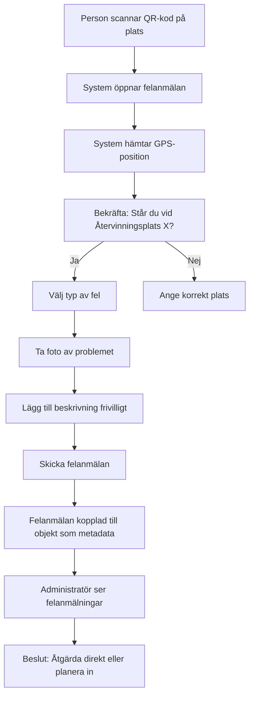

# Session 2026-01-14: Viktiga Insikter för Unicorn-projektet

**Datum:** 2026-01-14 11:12  
**Typ:** Affärsmöte - Upphandlingsanalys  
**Deltagare:** Mats och teamet (Magnus, Patrik)  
**Kontext:** Analys av konkret upphandling för återvinningsplatser och behållartvätt  

---

## SAMMANFATTNING

### Karaktär av Sessionen

**⚠️ VIKTIGT:** Detta var INTE ett utvecklingsmöte om Unicorn-systemet. Det var ett **konkret affärsmöte** där Mats och teamet analyserade en upphandling för städning av återvinningsplatser och behållartvätt. Merparten av diskussionen handlar om:

- Prissättning och kalkylering
- Ruttplanering för specifik upphandling  
- Tidsuppskattningar
- Antal fordon och personal som behövs
- Viten och tidsramar i upphandlingen

### Vad Är Relevant för Unicorn?

Trots att det är ett affärsmöte, innehåller sessionen **mycket värdefulla exempel på verkliga användningsfall** som systemet måste kunna hantera. Sessionen ger konkreta exempel på:

1. **Strukturartiklar i praktiken** - Städtjänster som grupp av åtgärder
2. **Besiktning och bedömning** - Rating och statusbedömning
3. **Dokumentationskrav** - Protokoll, rapporter, bilder
4. **Objekthierarki** - Klustermammor med underobjekt
5. **Schemaläggning** - Flexibla frekvenser och veckodagar
6. **Avvikelser och felanmälan** - Hur system ska hantera oväntade händelser
7. **QR-kod integration** - Felanmälan på plats
8. **Statistik och rapportering** - CO2, kemikalier, körsträckor

---

## Del 1: Huvudpunkter från Sessionen

### 1. Konkret Upphandling som Användarfall

**Vad:** Kinab analyserar en upphandling från ett kommunalt bolag (liknande Vafab/SRV) för:
- Städning och tillsyn av återvinningsplatser (c:a 50 gånger per år)
- Behållartvätt och tillsyn på olika adresser (måndag-söndag, olika frekvenser)

**Relevans för Unicorn:** Detta är exakt den typ av komplex schemaläggning som systemet ska hantera.

### 2. Strukturartiklar - Städtjänster

**Citat från Mats:**
> "Det här är ju då en sån här to-do-grej, en artikel kan man säga, eller en klusterartikel då. Som innehåller då sopning, krattning, snöröjning, sandning, behållarmateriel, utjämnat och sanering."

**Relevans:** Konkret exempel på hur en strukturartikel används i praktiken.

### 3. Tidslarm och Viten

**Citat:**
> "Sen finns det då viten och grejer här. Det finns tider då hur fort olika saker ska göras. Då står det en spis där så kanske den får stå ett litet tag. Men är det ett annat fel så kanske det måste åtgärdas tidigare."

**Nytt krav:** Systemet måste kunna hantera **tidslarm med olika tidsfrister** beroende på typ av åtgärd.

### 4. Dokumentationskrav - Protokoll och Rapporter

**Citat:**
> "När vi åker ut och städar så ska vi då upprätta ett städprotokoll här då."

**Krav:**
- Städprotokoll
- Återrapporteringsmall  
- Avvikelserapport

### 5. Objekthierarki - Klustermammor

**Citat:**
> "Objektstänkande där en plats (t.ex. Trädgårdsvägen) är en 'klustermamma' med underobjekt som individuella behållare för olika material."

**Exempel:**
```
Trädgårdsvägen (Klustermamma)
├── Tidningsbehållare 1
├── Tidningsbehållare 2
└── Pappersbehållare
```

### 6. Flexibel Schemaläggning

**Nytt krav från diskussion:**
> "Framtida system bör hantera flexibel schemaläggning för besök, inte endast fasta intervaller (t.ex. var 24:e timme)."

**Exempel:**
- Varannan dag
- På helger (lördag och söndag)
- Tre gånger i veckan
- Måndag, onsdag, fredag (men INTE lördag och söndag)

### 7. QR-koder för Felanmälan

**Citat från Mats:**
> "Att för den här kunden, om vi nu får den här kunden, att vi då också drar igång vår felanmälningstjänst skulle ju vara helt fantastiskt då. Så att när du då står där och lampan är trasig, då har vi en QR-kod på en liten snygg plakett eller en klistermärke."

**Process:**
1. Scanna QR-kod
2. Bekräfta position
3. Välj typ av fel
4. Ta foto
5. Information kopplas till objektet

---

## Del 2: Nya Insikter och Förtydliganden

### 2.1 Strukturartiklar med Variabel Kvantitet

**Ny Insikt:**

Strukturartiklar kan innehålla åtgärder som har **variabel kvantitet** baserat på säsong eller omständigheter.

**Exempel:**

**Vinter (snö):**
```javascript
{
  strukturartikel: "Återvinningsplats - Städning",
  åtgärder: [
    { typ: "Sopning", minuter: 5 },
    { typ: "Snöröjning", minuter: 15 },  // ← Relevant på vintern
    { typ: "Sandning", minuter: 3 },
    { typ: "Behållarmateriel", minuter: 10 }
  ]
}
```

**Sommar (ingen snö):**
```javascript
{
  strukturartikel: "Återvinningsplats - Städning",
  åtgärder: [
    { typ: "Sopning", minuter: 5 },
    { typ: "Snöröjning", minuter: 0 },  // ← Noll på sommaren
    { typ: "Sandning", minuter: 0 },
    { typ: "Behållarmateriel", minuter: 10 }
  ]
}
```

**Implikation för Implementation:**
- Strukturartiklar måste kunna ha **dynamiska värden** på underliggande åtgärder
- Vissa åtgärder kan vara "0" eller "ej tillämplig"
- Systemet måste kunna kontrollera att åtgärden verkligen behövs vid planeringstillfället

**Relaterar till tidigare diskussioner:** Detta är en utökning av strukturartikel-konceptet som inte tidigare diskuterats.

### 2.2 Besiktning med Rating/Bedömning

**Ny Insikt:**

Besiktning är inte bara "utförd/ej utförd" - det kan vara en **bedömning med kategorier**.

**Citat:**
> "Vill de då ha någon sorts bedömning, lite skräpigt, skräpigt och mycket skräpigt. Det är ju då ett exempel på en sån här, alltså besiktning eller vad man ska säga. Så då är det ju då en uppgift som går ut på att göra den här bedömningen."

**Konkret Exempel:**

```javascript
{
  uppgift: "Bedömning av nedskräpningsnivå",
  typ: "Besiktning",
  rullgardinval: [
    "Lite skräpigt",
    "Skräpigt", 
    "Mycket skräpigt"
  ],
  syfte: "Statistik"
}
```

**Mats tillägg:**
> "Det här är ju nu ett underlag som den här kunden kräver men det här måste ju också vara repeterbart om man tänker sig data för soprum."

**Implikation:** Detta är en **generell funktion** som kan användas bredare än bara för denna kund.

**Relaterar till tidigare diskussioner:** Tidigare har vi pratat om "rating" i samband med kundnöjdhet (4 av 5 tunnor tvättade). Detta är en **annan typ av rating** - objektiv bedömning av tillstånd.

### 2.3 Klottersanering - Separerad från Fast Uppdrag

**Ny Insikt:**

Klotter upptäcks vid besök, men saneringen är en **separat uppgift** som inte ingår i det fasta uppdraget.

**Process:**

1. **Upptäckt (vid ordinarie besök):**
   - Ta kort på klotter
   - Bild kopplas till objektet som **information**
   - Klottersanering ingår INTE i ordinarie uppdrag

2. **Insamling (veckovis):**
   - System samlar alla objekt med "klotter"-information
   - Skapar lista över klottersaneringsbehov
   - Extraherar till separat ärendehantering

3. **Dialog med kund:**
   - "Nu har vi fem stycken här som måste klottersaneras"
   - Prissättning
   - Planering av när det ska göras

4. **Utförande:**
   - Planeras som separat order
   - "Den går ut på tisdag nästa vecka"
   - Återrapportering till kund

**Citat:**
> "I det här uppdraget så ingår det inte då klottersanering i det fasta uppdraget, utan det samlar man liksom på sig då. Och då kan vi då lätt göra ett utdrag då och säga, ja, det här objektet nu har klottersanering och det här objektet har det."

**Implikation för Implementation:**

Systemet behöver kunna:
- ✅ Registrera information vid besiktning (klotter upptäckt)
- ✅ **Inte** automatiskt skapa order (det är separat)
- ✅ Skapa **listor** över objekt med viss information
- ✅ Hantera arbetsflöde: upptäckt → dialog → planering → utförande → återrapport

**Samma mönster gäller för:**
- Spill/oljeutsläpp
- Trasiga inhägnader
- Trasig belysning
- Stora föremål som behöver bortforsling (spisar, soffor)

**Relaterar till tidigare diskussioner:** Detta förtydligar hur **ologisk metadata** (bilder) kan trigga **logiska processer** (skapande av separata ordrar).

### 2.4 Individnummer och Besiktning av Komplexa Objekt

**Ny Insikt:**

Vissa objekt har **individnummer** och ska besiktas var för sig, inte summeras.

**Citat från tidigare dokument applicerat här:**
> "Om du har ett sådant där stort nedgrävt kärl och så är det fem stycken sådana på en återvinningsplats. Ja, i det fallet då så får ju inte du räkna ihop dem som fem stycken då. För att då är ju varje sådant objekt en egen, ska vi kalla det individ, med ett eget serienummer och så vidare."

**Exempel från session:**

**Behållartvätt med Skadebedömning:**
```
Uppgift: Årsstädning med besiktning
  ├── Kratta område
  ├── Tvätta samtliga behållare med högtryck
  └── Besiktning av varje behållare:
      - Individnummer: T22-001
      - Skick: "Påbackad" / "Eldat" / "OK"
      - Särskild notering för tidningar: "ej okej tidningar"
```

**Implikation:**
- Enkla objekt (10 pantkärl) = 1 uppgift: "Tvätta 10 pantkärl"
- Komplexa objekt med serienummer = 5 uppgifter: "Besikta behållare T22-001", "Besikta behållare T22-002", etc.

**Automatisk logik (från Mats tidigare):**
> "Om klustret består utav ett objekt som består av tio, då kommer den ju att hämta mängden tio stycken. Men om du då har ett objekt som består utav fem grenar och det är en sån här stor nedgrävd anläggning, då kommer den ju att lösa det där själv med grundlogiken."

### 2.5 Återrapportering och Avvikelserapporter

**Ny Insikt:**

Kunden kräver **två typer av rapporter**:

**1. Återrapporteringsmall (när allt OK):**
- Vad som gjorts
- När det gjordes
- Vem som gjorde det
- Bekräftelse att arbete är klart

**2. Avvikelserapport (när problem):**
- Vad för problem
- Var (vilket objekt)
- När upptäckt
- Foto
- Förslag på åtgärd

**Exempel från session:**
- Trasig inhägnad
- Trasig belysning
- Oljeutsläpp
- Nedkörd gatlykta

**Implikation för Implementation:**

Systemet behöver:
- ✅ Separata mallar för "OK-rapport" vs "Avvikelserap port"
- ✅ Automatisk generering vid uppgift-slutförande
- ✅ Möjlighet för utförare att flagga avvikelse
- ✅ Koppling av foto till avvikelse
- ✅ Skicka rapport till kund (automatisk eller manuell)

### 2.6 CO2 och Kemikaliestatistik

**Ny Insikt:**

Upphandlingar kräver **miljöstatistik**.

**Citat:**
> "Statistik på kemikalier och koldioxidutsläpp, inklusive en bilaga för körsträcka och energianvändning."

**Krav:**
- CO2-utsläpp baserat på körsträcka
- Energianvändning (bensin, diesel, el)
- Kemikalier som används (för städning/sanering)

**Mats kommentar:**
> "Det här blir ju standardframgent med alla upphandlingar egentligen."

**Implikation:**
- Systemet måste logga körsträcka per order
- Koppla fordon till order (för att beräkna CO2)
- Eventuellt logga kemikalieanvändning per åtgärd
- Kunna generera statistikrapport

**Relaterar till tidigare diskussioner:** Tidigare har ruttoptimering nämnts. Nu ser vi **varför** exakt körsträcka är viktig - inte bara för effektivitet utan för miljörapportering.

### 2.7 Flexibel Schemaläggning - Inte Bara Fasta Intervall

**Kritisk Ny Insikt:**

**Citat från summary:**
> "Framtida system bör hantera flexibel schemaläggning för besök, inte endast fasta intervaller (t.ex. var 24:e timme)."

**Problem med fasta intervaller:**

Om man sätter "var 24:e timme" kan det orsaka att scheman "korsar varandra" - att samma objekt får flera besök på samma dag av misstag.

**Lösning - Objektspecifik Frekvens:**

> "Behov av objektsspecifik frekvens för åtgärder, exempelvis att ett objekt behöver tvättas varannan dag och på helger (lördag och söndag)."

**Konkreta Exempel från Session:**

**Arholmavägen:**
- Måndag: Ja
- Tisdag: Nej
- Onsdag: Ja
- Torsdag: Nej
- Fredag: Ja
- Lördag: **NEJ**
- Söndag: **NEJ**

**Annan adress:**
- Måndag-Fredag: Ja
- Lördag: **JA**
- Söndag: **JA**

**Ytterligare ett exempel:**
- "Upp till tre eller fyra tvättar i veckan" (inte var 24:e timme)
- "Två gånger per år" (mycket långt intervall)

**Implikation för Implementation:**

Schemaläggningssystem måste stödja:
- ✅ Specifika veckodagar (måndag, onsdag, fredag)
- ✅ Varannan dag (inte fast "var 48:e timme")
- ✅ X gånger per vecka (3-4x per vecka = inte samma dagar varje vecka)
- ✅ Sällan (årligen, halvårligen)
- ✅ Kombination: "Vardagar OCH helger" eller "Vardagar men INTE helger"

**Relaterar till tidigare diskussioner:** Tidigare har "frekvens" nämnts som metadata, men inte hur **flexibel** den måste vara.

---

## Del 3: Ändringar eller Motsägelser

### 3.1 Inga Direkta Motsägelser

**Analys:** Inga direkta motsägelser mot tidigare diskussioner. Däremot finns **förtydliganden** och **utvidgningar** av koncept.

### 3.2 Förtydliganden

#### A. Rating/Bedömning - Två Typer

**Tidigare:**
- Rating = kundnöjdhet (4 av 5 tunnor OK)

**Nu:**
- Rating kan också vara **objektiv bedömning** (lite skräpigt / mycket skräpigt)

**Hantering:** Båda typerna av rating ska finnas, men med olika syften.

#### B. Strukturartiklar - Variabla Värden

**Tidigare:**
- Strukturartikel = fast lista av underåtgärder

**Nu:**
- Strukturartikel kan ha **dynamiska värden** (snöröjning = 0 på sommaren)

**Hantering:** Implementation måste tillåta variabla värden, inte bara fasta.

#### C. Metadata Trigger vs Automatisk Order

**Tidigare:**
- Inte tydligt hur metadata används för att skapa ordrar

**Nu:**
- **Klarhet:** Vissa metadata (klotter, spill) skapar **inte** automatiska ordrar, utan **listor** som sedan hanteras manuellt

**Hantering:** Skilja mellan:
- Metadata som trigger automatisk order (frekvens, artikel)
- Metadata som bara är information för manuell hantering (klotter, avvikelser)

---

## Del 4: Konkreta Exempel och Användningsfall

### 4.1 Återvinningsplatser - Städuppdrag

**Scenario:**

Kinab har ett avtal om att städa återvinningsplatser där människor dumpar tidningar, papper, glas - men också spisar, soffor och vinterdäck.

**Två Typer av Uppdrag:**

**1. Ordinarie Städning (3-4x per vecka):**
- En person med skåpbil
- Städa upp mindre skräp
- Ta kort på större föremål
- Rapportera klotter
- Uppskattad tid: 25 minuter per plats

**2. Bortforsling av Stora Föremål (tillägg):**
- Lastbil med kran ("tjälvträdbil")
- Förare + assistent
- Hämta stora föremål (köksinredning, soffor, spisar)
- Dumpning
- Separat prissättning

**Objektstruktur:**

```
Återvinningsplats Arholmavägen (Organisatoriskt objekt)
├── Glascontainer (Fysiskt objekt)
├── Papperscontainer (Fysiskt objekt)
└── Tidningscontainer (Fysiskt objekt)

Metadata på "Återvinningsplats Arholmavägen":
- Adress: "Arholmavägen, [postnummer]"
- GPS: "[koordinater]"
- Frekvens: Måndag, Onsdag, Fredag (INTE lördag/söndag)
- Artikel: "Städning återvinningsplats"
- Uppskattad tid: 25 minuter
```

**Orderkoncept:**

```javascript
{
  namn: "Återvinningsplatser - Veckobesök",
  matchning: {
    typ: "Återvinningsplats",
    frekvens: ["Måndag", "Onsdag", "Fredag"]
  },
  artikel: "Städning återvinningsplats",
  strukturartikel: {
    åtgärder: [
      { typ: "Sopning", tid: 10 },
      { typ: "Tömma papperskorgar", tid: 5 },
      { typ: "Fotografera stora föremål", tid: 5 },
      { typ: "Kolla klotter", tid: 3 },
      { typ: "Rapportera avvikelser", tid: 2 }
    ]
  }
}
```

**När Stora Föremål Upptäcks:**

1. Utförare tar kort
2. Bild kopplas till objektet
3. Administratör ser lista över objekt med "stora föremål"
4. Planerar in bortforsling med stor lastbil
5. Separat order skapas

### 4.2 Behållartvätt - Schema med Olika Frekvenser

**Scenario:**

Kinab har avtal om att tvätta behållare på olika adresser med **mycket varierande frekvenser**.

**Exempel:**

| Adress | Antal Behållare | Frekvens |
|--------|-----------------|----------|
| Arholmavägen | 5 (små) | Mån, Ons, Fre |
| Trädgårdsvägen | 3 (små) | Mån-Fre + Lör-Sön |
| Industrivägen | 12 (stora) | 3-4x per vecka |
| Storgatan | 2 (små) | 2x per år |

**Objektstruktur för Trädgårdsvägen:**

```
Trädgårdsvägen (Klustermamma - Organisatoriskt)
├── Tidningsbehållare 1 (Fysiskt objekt)
│   └── Individnummer: TG-TID-001
├── Tidningsbehållare 2 (Fysiskt objekt)
│   └── Individnummer: TG-TID-002
└── Pappersbehållare (Fysiskt objekt)
    └── Individnummer: TG-PAP-001

Metadata på "Trädgårdsvägen":
- Adress: "Trädgårdsvägen 45, Uppsala"
- GPS: "[koordinater]"
- Antal behållare: 3
- Klassificering: "Små" (upp till 7 behållare)
- Frekvens: "Måndag-Fredag + Lördag-Söndag"
- Artikel: "Tvätta behållare"
```

**Schemaläggning:**

Systemet genererar order baserat på:
- Veckodagar (Måndag-Söndag)
- Antal behållare påverkar tid (3 behållare × 3 min = 9 min)
- Klassificering påverkar pris (små vs stora)

### 4.3 Årsstädning med Besiktning

**Scenario:**

En gång per år ska återvinningsplatser **storstädas** och alla behållare **besiktas**.

**Strukturartikel:**

```javascript
{
  namn: "Årsstädning + Besiktning",
  typ: "Strukturartikel",
  åtgärder: [
    {
      typ: "Krattning av omgivning",
      tid: 30,
      beroenden: []
    },
    {
      typ: "Högtvätt av alla behållare",
      tid: 15,  // per behållare
      multipliceras_med_antal: true
    },
    {
      typ: "Besiktning av behållare",
      tid: 5,  // per behållare
      multipliceras_med_antal: true,
      kräver_individuell_hantering: true,  // ← Viktig flagga!
      bedömningsfält: [
        {
          namn: "Skick",
          typ: "Rullgardin",
          val: ["OK", "Påbackad", "Eldat", "Spricka", "Rostig"]
        },
        {
          namn: "Tidningar OK",
          typ: "Boolean"
        },
        {
          namn: "Foto",
          typ: "Bild",
          obligatorisk_om: ["Påbackad", "Eldat", "Spricka"]
        }
      ]
    }
  ]
}
```

**Utförande:**

För en plats med 5 behållare:

1. **En uppgift:** Krattning (30 min)
2. **En uppgift:** Högtvätt 5 behållare (5 × 15 = 75 min)
3. **Fem uppgifter:** Besiktning behållare 1-5 (vardera 5 min)

### 4.4 Snöröjning - Variabel Uppgift

**Scenario:**

Återvinningsplatser ska snöröjas vid behov, men uppgiften varierar enormt beroende på snömängd.

**Strukturartikel med Dynamiska Värden:**

```javascript
// Vinter med mycket snö:
{
  objekt: "Återvinningsplats Arholmavägen",
  uppgift: "Städning",
  åtgärder: [
    { typ: "Sopning", minuter: 5 },
    { typ: "Snöröjning", minuter: 45 },  // ← Mycket snö!
    { typ: "Sandning", minuter: 10 }
  ],
  total_tid: 60 minuter
}

// Sommar (ingen snö):
{
  objekt: "Återvinningsplats Arholmavägen",
  uppgift: "Städning",
  åtgärder: [
    { typ: "Sopning", minuter: 5 },
    { typ: "Snöröjning", minuter: 0 },  // ← Ingen snö!
    { typ: "Sandning", minuter: 0 }
  ],
  total_tid: 5 minuter
}
```

**Avvikelse:**

Om snömängd är för stor för vanlig utrustning:

```javascript
{
  typ: "Avvikelse",
  objekt: "Återvinningsplats Arholmavägen",
  beskrivning: "Snöhögar kräver traktor",
  åtgärd: "Beställ traktor för borttagning",
  foto: "[bild på snöhög]"
}
```

**Implikation:**
- Uppgifter måste kunna justeras baserat på faktiska förhållanden
- Utförare måste kunna flagga när standarduppgift inte räcker
- Avvikelser kan trigga **beställning** av extra resurser

---

## Del 5: Tekniska Detaljer

### 5.1 Städprotokoll - Mall och Innehåll

**Krav från Upphandling:**

När städuppdrag utförs ska ett **protokoll** upprättas.

**Innehåll i Städprotokoll:**

```javascript
{
  protokolltyp: "Städprotokoll",
  objekt_id: 35755,
  objekt_namn: "Återvinningsplats Arholmavägen",
  datum: "2026-01-14",
  utförare: "Magnus Andersson",
  
  åtgärder_utförda: [
    { typ: "Sopning", status: "Utfört", tid: 5 },
    { typ: "Snöröjning", status: "Utfört", tid: 15 },
    { typ: "Sandning", status: "Ej tillämpligt", tid: 0 }
  ],
  
  bedömning_nedskräpning: "Skräpigt",  // Lite / Skräpigt / Mycket
  
  avvikelser: [
    {
      typ: "Klotter",
      beskrivning: "Klotter på papperscontainer",
      foto: "klotter_001.jpg"
    }
  ],
  
  foton: {
    före: "fore_arholma_20260114.jpg",
    efter: "efter_arholma_20260114.jpg"
  },
  
  signatur_utförare: "...",
  tidsstämpel: "2026-01-14T08:45:00Z"
}
```

### 5.2 Avvikelserapport - Mall och Innehåll

**Krav från Upphandling:**

Om problem upptäcks ska en **avvikelserapport** upprättas.

**Innehåll i Avvikelserapport:**

```javascript
{
  rapporttyp: "Avvikelserapport",
  objekt_id: 35755,
  objekt_namn: "Återvinningsplats Arholmavägen",
  datum_upptäckt: "2026-01-14",
  upptäckt_av: "Magnus Andersson",
  
  avvikelse_typ: "Skada",  // Skada / Säkerhetsproblem / Funktion / Annat
  
  beskrivning: "Inhägnad trasig, stolpe nedkörd",
  
  allvarlighetsgrad: "Medel",  // Låg / Medel / Hög / Kritisk
  
  foton: [
    "inhagnad_trasig_001.jpg",
    "inhagnad_trasig_002.jpg"
  ],
  
  föreslagen_åtgärd: "Byt stolpe och reparera staket",
  
  uppskattad_kostnad: 5000,  // SEK
  
  kräver_omedelbar_åtgärd: false,
  
  status: "Rapporterad",  // Rapporterad / Under utredning / Åtgärdad
  
  tidsstämpel: "2026-01-14T08:50:00Z"
}
```

### 5.3 QR-kod Felanmälan - Flöde

**Process:**



**Teknisk Implementation:**

```javascript
// QR-kod innehåller:
{
  typ: "felanmalan",
  objekt_id: 35755,
  objekt_namn: "Återvinningsplats Arholmavägen",
  redirect_url: "https://kinab.se/felanmalan?objekt=35755"
}

// När användare scannar:
1. Öppna webbsida/app
2. Hämta GPS (navigator.geolocation)
3. Bekräfta position (jämför med objektets GPS ±50m)
4. Visa formulär:
   - Typ av fel (rullgardin)
   - Ta foto (kamera)
   - Beskrivning (fritext, valfri)
5. POST till API: /api/felanmalan
6. Spara som metadata på objekt:
   {
     metadatatyp: "Felanmälan",
     värde_json: {
       typ: "Trasig belysning",
       beskrivning: "Lampa 2 fungerar ej",
       foto: "lampor_arholma_001.jpg",
       gps: "59.3156, 18.0649",
       tidsstämpel: "2026-01-14T12:30:00Z",
       rapporterad_av: "Anonym"
     }
   }
```

### 5.4 CO2 och Miljöstatistik - Datamodell

**Krav:**

Upphandlingar kräver rapportering av:
- CO2-utsläpp
- Körsträcka
- Energianvändning

**Datamodell:**

```javascript
// Per Order:
{
  order_id: "ORD_2026_001234",
  datum: "2026-01-14",
  fordon_id: "BIL_003",
  
  körsträcka: {
    planerad_km: 45,    // Från ruttoptimering
    faktisk_km: 52,     // Från GPS-loggning
    diff_km: 7          // Avvikelse
  },
  
  energi: {
    drivmedel_typ: "Diesel",  // Diesel / Bensin / El / HVO
    förbrukning_liter: 4.2,   // Eller kWh för el
    co2_per_liter: 2.66,      // kg CO2 per liter diesel
    total_co2_kg: 11.17       // 4.2 × 2.66
  }
}

// Sammanställning per Period:
{
  period: "2026-01",  // Månad
  kund: "Axfood",
  
  totaler: {
    antal_order: 450,
    total_körsträcka_km: 15800,
    total_co2_kg: 4220,
    
    per_drivmedel: {
      diesel: {
        liter: 1200,
        co2_kg: 3192
      },
      el: {
        kwh: 850,
        co2_kg: 85  // Lägre för el
      }
    }
  },
  
  kemikalier: [
    {
      typ: "Rengöringsmedel XYZ",
      mängd_liter: 120,
      miljömärkning: "Svanenmärkt"
    }
  ]
}
```

**API Endpoint:**

```
GET /api/statistik/miljo?kund=Axfood&period=2026-01

Response:
{
  period: "2026-01",
  co2_total_kg: 4220,
  korsträcka_total_km: 15800,
  energi: {...},
  kemikalier: {...}
}
```

### 5.5 Schemaläggning - Datastruktur för Flexibel Frekvens

**Problem:**

Nuvarande tänk med "var 24:e timme" räcker inte.

**Lösning - Frekvens som Komplex Datastruktur:**

```javascript
// Metadata: Frekvens
{
  metadatatyp: "Frekvens",
  objekt_id: 35755,
  värde_json: {
    typ: "Specifika veckodagar",
    dagar: ["Måndag", "Onsdag", "Fredag"],
    exkludera: ["Lördag", "Söndag"],
    tid_förmiddag: "06:00-10:00",
    säsong: null  // Null = hela året
  }
}

// Alternativ frekvens:
{
  typ: "Intervall med variation",
  bas_intervall: "3-4 gånger per vecka",
  min_dagar_mellan: 1,
  max_dagar_mellan: 3,
  flexibel_planering: true
}

// Ytterligare alternativ:
{
  typ: "Sällan",
  intervall: "2 gånger per år",
  önskade_månader: ["April", "Oktober"],
  tidsfönster: "Bred flexibilitet"
}

// Kombinerad:
{
  typ: "Kombination",
  vardagar: true,
  helger: true,
  frekvens_vardag: "Dagligen",
  frekvens_helg: "En gång per dag"
}
```

**Schemaläggare Logic:**

```javascript
function genereraOrderDatum(objekt, frekvens, startDatum, slutDatum) {
  const datum = [];
  
  if (frekvens.typ === "Specifika veckodagar") {
    let current = startDatum;
    while (current <= slutDatum) {
      const veckodag = getDayName(current);
      
      // Kolla om denna veckodag är inkluderad
      if (frekvens.dagar.includes(veckodag) && 
          !frekvens.exkludera.includes(veckodag)) {
        datum.push(current);
      }
      
      current = addDays(current, 1);
    }
  }
  
  // ... andra typer av frekvenser
  
  return datum;
}
```

---

## Del 6: Action Items

### 6.1 Vad Behöver Uppdateras i Tidigare Dokument?

#### A. Mats_Objektdata_Metadata_Analys.md

**Lägg till:**

1. **Metadata-typer:**
   - Frekvens (utökad med flexibla veckodagar)
   - Bedömning/Rating (objektiv tillståndsbedömning)
   - Felanmälan (från QR-kod)

2. **Protokoll och Rapporter:**
   - Städprotokoll
   - Avvikelserapport
   - Återrapporteringsmall

3. **Miljödata:**
   - CO2-statistik
   - Kemikalieanvändning
   - Körsträcka

#### B. Mats_Klustervision_Uppdaterad_Final.md

**Lägg till:**

1. **Strukturartiklar med Variabla Värden:**
   - Snöröjning = 0 på sommaren
   - Dynamiska åtgärder

2. **Besiktning med Individuell Hantering:**
   - När objekt ska behandlas var för sig
   - Individnummer

3. **QR-kod Felanmälan:**
   - Process
   - Integration med objektmetadata

#### C. Replit_3.0_Prompt_Objektdata_Metadata.md

**Lägg till:**

1. **Frekvens-datastruktur:**
   - JSON-schema för flexibel frekvens
   - Schemaläggningslogik

2. **Protokoll-generering:**
   - Mall för städprotokoll
   - Mall för avvikelserapport
   - Automatisk generering vid uppgift-slutförande

3. **Miljöstatistik:**
   - CO2-beräkning
   - Körsträcka-loggning

### 6.2 Vad Behöver Implementeras?

#### Prioritet 1 (Kritiskt)

1. **Flexibel Schemaläggning**
   - Specifika veckodagar (inte bara intervall)
   - Kombination vardagar/helger
   - Variabel frekvens ("3-4x per vecka")

2. **Strukturartiklar med Dynamiska Värden**
   - Möjlighet att sätta åtgärd = 0
   - Säsongsbaserade justeringar

3. **Protokoll och Rapporter**
   - Städprotokoll-mall
   - Avvikelserapport-mall
   - Automatisk generering

#### Prioritet 2 (Viktigt)

4. **QR-kod Felanmälan**
   - QR-kod generering
   - Mobilwebb för felanmälan
   - Koppling till objektmetadata

5. **Besiktning med Bedömning**
   - Rullgardinval (Lite skräpigt / Skräpigt / Mycket skräpigt)
   - Rating-system för objektiv bedömning
   - Statistik baserat på bedömningar

6. **Individuell Hantering av Komplexa Objekt**
   - Identifiera när objekt ska behandlas var för sig
   - Individnummer-hantering
   - Separat uppgift per objekt

#### Prioritet 3 (Önskvärt)

7. **Miljöstatistik**
   - CO2-beräkning per order
   - Körsträcka-loggning
   - Kemikalieanvändning
   - Statistikrapport

8. **Metadata-Triggar för Separata Ordrar**
   - Identifiera metadata som indikerar behov (klotter, stora föremål)
   - Lista objekt med viss metadata
   - Manuell eller automatisk skapande av separata ordrar

### 6.3 Prioritering

**Ordning baserat på affärsvärde:**

1. **Flexibel Schemaläggning** - Utan detta kan systemet inte hantera verkliga kundkrav
2. **Protokoll och Rapporter** - Krav från upphandlingar
3. **Strukturartiklar med Dynamiska Värden** - Nödvändigt för säsongsvariationer
4. **QR-kod Felanmälan** - Konkurrensförfördel, förbättrar datakvalitet
5. **Miljöstatistik** - Krav från upphandlingar, blir vanligare
6. **Besiktning och Rating** - Förbättrar kvalitetskontroll
7. **Individuell Objekthantering** - Nödvändigt för serviceuppdrag

---

## Del 7: Citat och Nyckeluttalanden

### 7.1 Om Strukturartiklar

> **Mats:** "Det här är ju då en sån här to-do-grej, en artikel kan man säga, eller en klusterartikel då. Som innehåller då sopning, krattning, snöröjning, sandning, behållarmateriel, utjämnat och sanering."

**Betydelse:** Konkret exempel på hur strukturartiklar används i praktiken för en komplex uppsättning åtgärder.

### 7.2 Om Tidslarm och Flexibilitet

> **Mats:** "Sen finns det då viten och grejer här. Det finns tider då hur fort olika saker ska göras. Då står det en spis där så kanske den får stå ett litet tag. Men är det ett annat fel så kanske det måste åtgärdas tidigare. Och då ser du också behovet av att kunna styra in det här i produktionssystemet med tidslarm."

**Betydelse:** Systemet måste hantera **olika tidsfrister** för olika typer av åtgärder.

### 7.3 Om Storstädning som Planeringsflexibilitet

> **Mats:** "Om du tar den här storstädningen att den ska bara göras en gång per år. Där har vi ett jättestort tidsfönster på den så att vi kan planera in den när vi har överkapacitet om du förstår vad jag menar."

**Betydelse:** Sällan uppgifter med brett tidsfönster kan användas för att **optimera resursanvändning** när det finns överkapacitet.

### 7.4 Om Besiktning och Bedömning

> **Användare:** "Det här kan jag också, det här är ju nu ett underlag som den här kunden kräver men det här måste ju också vara repeterbart om man tänker sig data för soprum."
>
> **Mats:** "Ja, ja, det går att tillämpa på alla."

**Betydelse:** Bedömningssystem (lite skräpigt / mycket skräpigt) ska vara **generellt tillämpligt**, inte bara för denna kund.

### 7.5 Om Klotter som Separat Hantering

> **Mats:** "I det här uppdraget så ingår det inte då klottersanering i det fasta uppdraget, utan det samlar man liksom på sig då. Och då kan vi då lätt göra ett utdrag då och säga, ja, det här objektet nu har klottersanering och det här objektet har det."

**Betydelse:** Metadata kan användas för att **samla information över tid** och sedan skapa separata ordrar.

### 7.6 Om Felanmälan med QR-kod

> **Mats:** "Att för den här kunden, om vi nu får den här kunden, att vi då också drar igång vår felanmälningstjänst skulle ju vara helt fantastiskt då. Så att när du då står där och lampan är trasig, då har vi en QR-kod på en liten snygg plakett eller en klistermärke."

**Betydelse:** QR-koder på plats kan **revolutionera** hur felanmälningar och information samlas in.

### 7.7 Om AI för Sammanställning

> **Mats:** "AI kan inte veta vad som ska göras, men AI kan hjälpa oss att kanske sammanställa det här."

**Betydelse:** AI är ett **verktyg för analys och sammanställning**, inte för beslut.

### 7.8 Om CO2-rapportering

> **Användare:** "Det här blir ju standardframgent med alla upphandlingar egentligen."

**Betydelse:** Miljörapportering (CO2, kemikalier) kommer att bli **standardkrav** i framtiden.

### 7.9 Om Flexibel Schemaläggning

> **Summary:** "Framtida system bör hantera flexibel schemaläggning för besök, inte endast fasta intervaller (t.ex. var 24:e timme)."

**Betydelse:** Schemaläggning med "var X:e timme" är **för simpel** för verkliga behov.

### 7.10 Om Objektfrekvens för Helger

> **Summary:** "Behov av objektsspecifik frekvens för åtgärder, exempelvis att ett objekt behöver tvättas varannan dag och på helger (lördag och söndag)."

**Betydelse:** Vissa objekt behöver service **oftare på helger** (när fler människor använder återvinningsplatser).

---

## SLUTSATS

### Huvudsaklig Takeaway

Denna session var ett **affärsmöte om en konkret upphandling**, inte ett utvecklingsmöte om systemet. Trots det innehåller den **mycket värdefulla användningsfall** som visar hur systemet kommer att användas i praktiken.

### Viktigaste Insikterna

1. **Flexibel Schemaläggning är Kritisk** - Fasta intervall räcker inte
2. **Strukturartiklar Måste Vara Dynamiska** - Värden kan vara 0 eller variera
3. **Protokoll och Rapporter är Kundkrav** - Måste automatiseras
4. **QR-kod Felanmälan är Kraftfullt** - Förbättrar datakvalitet dramatiskt
5. **Metadata Kan Trigga Manuella Processer** - Inte allt ska vara automatiskt
6. **Miljörapportering blir Standard** - Bygg in från början
7. **Besiktning ≠ Bara Ja/Nej** - Kan vara bedömning med flera nivåer

### Nästa Steg

1. Uppdatera tidigare dokument med nya insikter
2. Prioritera implementation av flexibel schemaläggning
3. Designa mallar för protokoll och rapporter
4. Skissa på QR-kod felanmälan
5. Planera för miljöstatistik från start

**Dokumentet avslutat: 2026-01-14**
